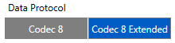
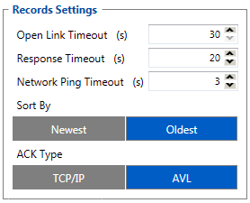
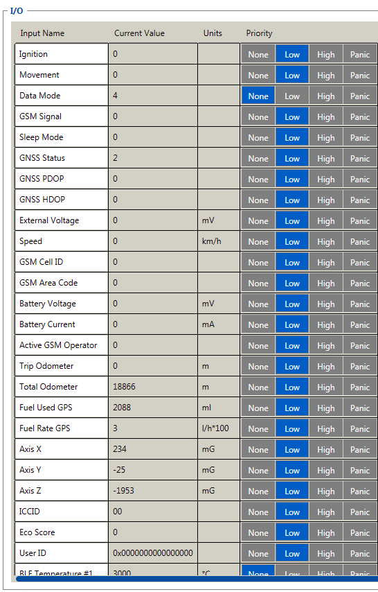
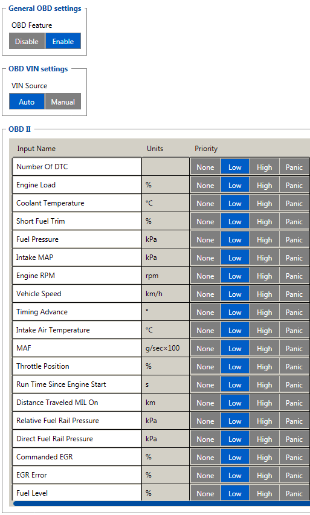
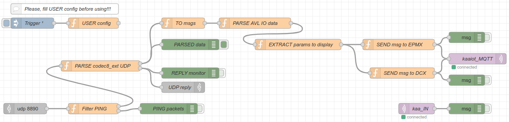
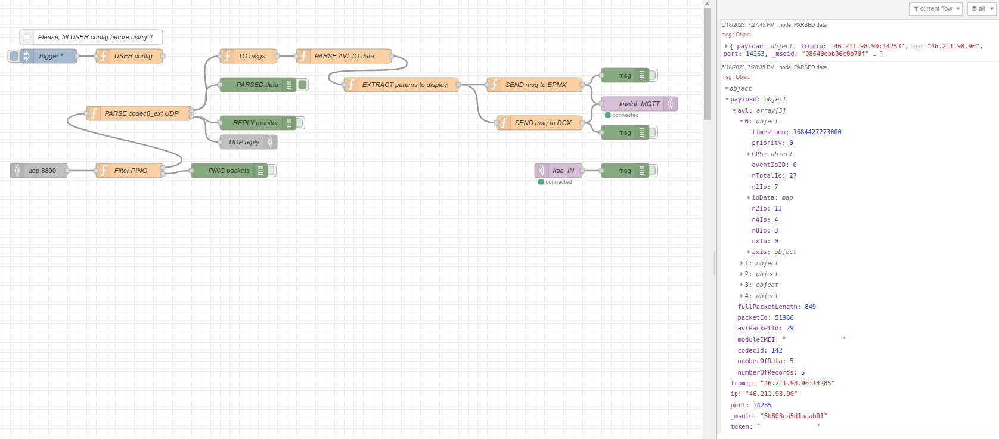
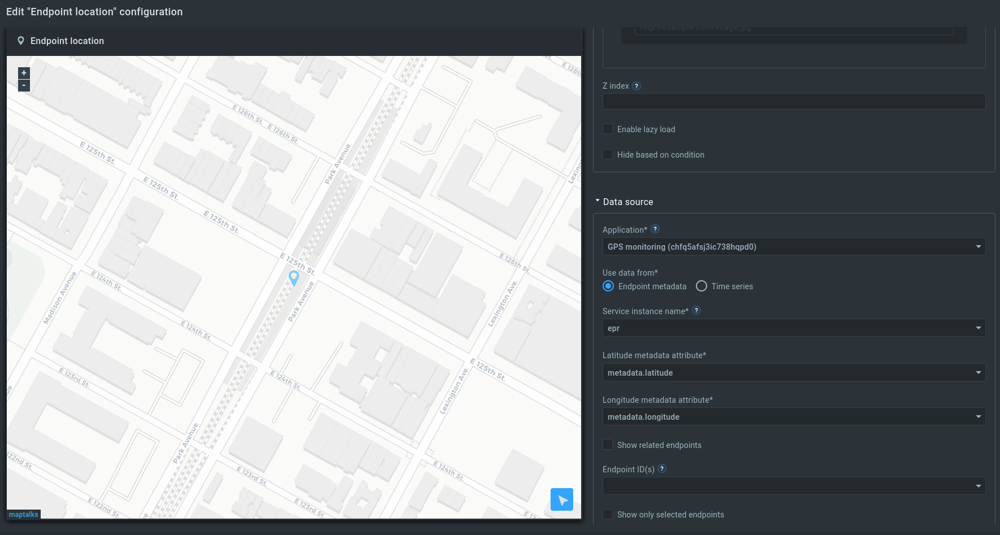




* TOC
{:toc}


## Overview

In this tutorial, we will look at how to integrate a Teltonika tracking device with the Kaa IoT platform.
You will learn how to create a digital twin of your tracking device, connect the device to Kaa, submit some telemetry and view it in the Kaa web interface.

## Prerequisites

1. You have the installed the [Node-RED][the-node-red] (you can use the Raspberry Pi board to install the Node-RED, install it on the PC or use some service that provide the access to the Node-RED)
2. You have an account in the [Kaa cloud][Kaa cloud]


## Playbook

### UDP connection

#### Configure your tracking device (UDP)

For the tutorial, we will use the [FMB003][FMB003] tracker - is the smallest [Teltonika][teltonika] 2G tracker with OBDII socket that fits perfectly in any car.

FMB003 supports [Codec 8][codec-8] and [Codec 8 Extended][codec-8-extended] data protocols.
We will use the [Codec 8 Extended][codec-8-extended] protocol.
It is possible to connect the tracker both via UDP and TCP. 
For the beginning let’s consider connecting via UDP as simpler.

Select the protocol we need in the settings [System settings][fmb003-system-settings]



After that, we need to configure the Node-RED server settings where the data will be sent. 

> NOTE: The IP must be an external IP and the port must be open for connections.
{:.important}


Next let's configure Record settings.

The use of PING in the case of UDP is not necessary at all.



Now we need to choose what data from the tracker we want to receive on the server. In this case, all options are selected.



Because Tracker FMB003 has the ability to connect via ODB, you also need to configure the parameters read via OBD.




#### Configure the Kaa platform

Now we need to create an application and the endpoint in the [Kaa cloud][Kaa cloud].

> NOTE: Please use [tutorial][connecting-your-first-device] for help.
> {:.note}

We will use the tracking device's IMEI as a token.

We will use the [Node-RED][the-node-red] as the gateway transforming raw TCP or UDP payloads into the format consumable by the Kaa platform.

#### The Node-RED UDP flow configuration

Let's take a look at our Node-RED flow.



```json

```

To enable connection via UDP, we use the **UDP IN** node.
The first node after the receiving node is the **Filter PING** node, which filters out PING packets.

The **PARSE codec8_ext UDP** node converts the binary data into an array of AVL data and sends it further to the **TO msgs** node. It also generates UDP responses on the second output.
The **TO msgs** node converts an array of AVL entries into individual messages.
In the **PARSE AVL IO data** node, the IO data is decrypted. 
The next node selects the data to be sent to the Kaa platform and after that the data is sent to the EPMX and DCX services.

In this case, we duplicate the data both in the metadata and in the time-series.
EPMX service receives **metadata**, DCX - **time-series**.
The **kaaiot_MQTT** node contains the IP and port settings for connecting to the Kaa platform.

To send data to the Kaa platform, we need 2 parameters:
* appVersion
* endpoint token

**appVersion** we must specify in the **USER config** node.

The token is the tracking device's IMEI and it is extracted from the input data.

If the tracking device is on and is configured correctly then we can see in Node-RED in debug window the packets (if **PARSED data** debug is on):



#### The Kaa widget configuration

Let's return to our solution and add **Endpoint location** widget.

We have to select the application and metadata keys with the location.



Now we can see the location of the tracking device on the widget's map.


Congratulations, you have successfully received telemetry from a Teltonika tracking device via UDP and visualized it in the Kaa UI!

### TCP connection

#### Configure your tracking device (TCP)

Let's try to use TCP as a transport protocol for tracking device connection.

We have to reconfigure out tracking device to use the TCP protocol.


It is preferable to use Ping packets to prevent connection from closing.
See the [Records Settings][fmb003-gprs-settings] on how to configure the ping timeout.

#### The Node-RED TCP flow configuration

Let's take a look at our Node-red TCP flow.


```json

```

When the tracking device sends the data by UDP the device IMEI is present in each packet.

But when the TCP transport protocol is used the device IMEI is sent just once during the establishing TCP connection.
Next packets don't contain device IMEI. 

That's why we have to save the combination {TCP session ID, IMEI} during the establishing connection. Later we can understand which packet is arrived according to the session ID.

The **Filter CONNECT packet** selects the first TCP packet which establishes a connection.

The **SAVE IMEI and send TCP reply** node is responsible for saving the TCP session ID and IMEI during establishing a connection.

The **FIND IMEI by sessionID** node looks for IMEI by TCP session ID.

Other nodes are the same as in the UDP flow.

> NOTE: Don't forget to specify your **appVersion** in the **USER config** node.
{:.important}

If all works fine we have to see the packets in the debug Node-RED window and the data will arrive to your Kaa cloud account.

## Next steps

* Join the discussion at our [community chat][Kaa user chat] and share feedback!


[FMB003]:                             https://teltonika-gps.com/products/trackers/fmb003
[teltonika]:                          https://teltonika-gps.com
[the-node-red]:                       https://nodered.org
[codec-8]:                            https://wiki.teltonika-gps.com/view/Codec#Codec_8
[codec-8-extended]:                   https://wiki.teltonika-gps.com/view/Codec#Codec_8_Extended
[fmb003-system-settings]:             https://wiki.teltonika-gps.com/view/FMB003_System_settings
[fmb003-gprs-settings]:               https://wiki.teltonika-gps.com/view/FMB003_GPRS_settings
[connecting-your-first-device]:       https://docs.kaaiot.io/KAA/docs/current/Tutorials/getting-started/connecting-your-first-device
[connecting-node-red-to-the-kaa]:     https://docs.kaaiot.io/KAA/docs/current/Tutorials/device-integration/connecting-node-red-to-kaa