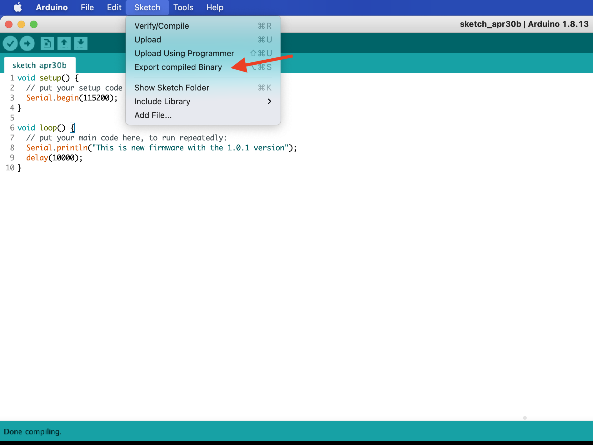
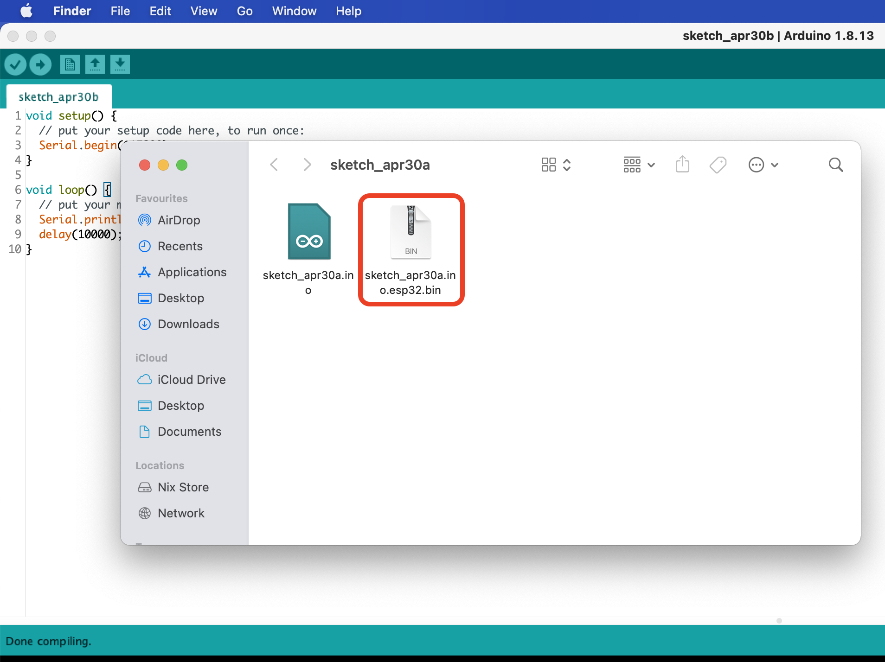
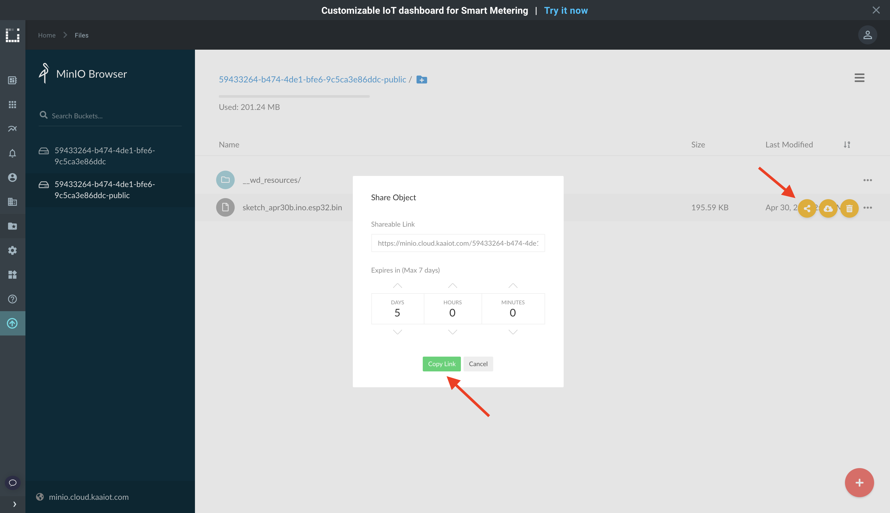
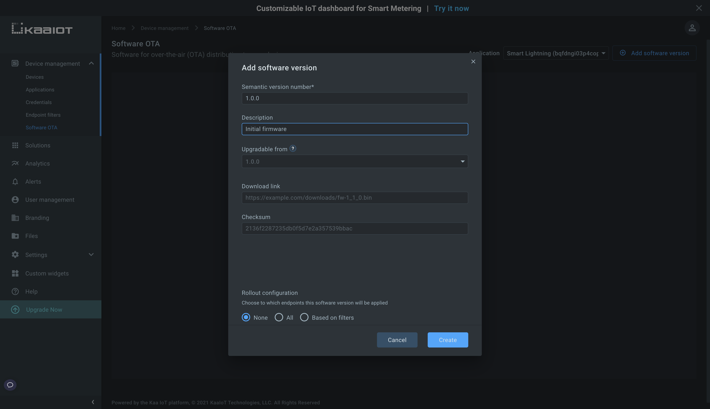
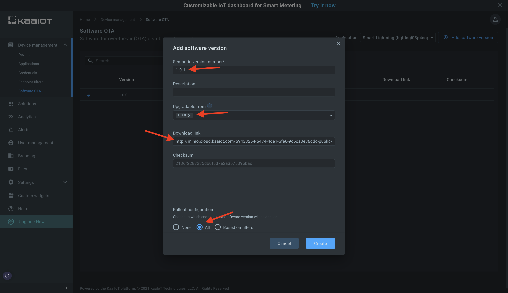
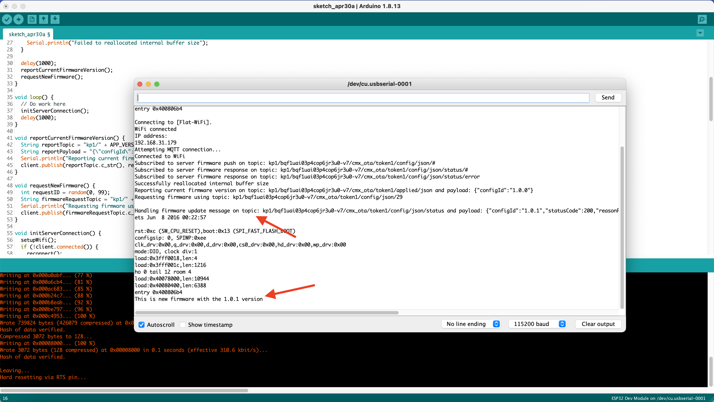




* TOC
{:toc}

In this tutorial, we will look at how to do over-the-air (OTA) update for ESP32. 


## Prerequisites

1. You know how to connect your ESP to the Kaa platform.


## Playbook


### Compile and host new firmware binary

Compile and upload the new firmware binary file to Kaa File Management.

If you use Arduino IDE choose **Sketch** -> **Export compiled Binary**.



After the compilation is done, choose **Sketch** -> **Show Sketch Folder**.



This is a new firmware that we are going to update our ESP32 to.

Next, we should host it on the HTTP server.
ESP32 is also able to download its firmware from the HTTPS server but to keep things simple we chose HTTP.

Let's host compiled binary.  

Go to your [Kaa Cloud account][Kaa cloud] -> **Files** and choose bucket suffixed with the `public`.
All files stored in that bucket are publicly available.
This is exactly what we need as in this tutorial we want our ESP32 to download firmware binary without extra authentication.

Upload the binary and get its sharable link.
Remember the link, we will need it in a moment.




### Initial firmware definition provisioning

Firstly, we should provision the initial firmware that our device has by default, from the factory, for example.

Go to Kaa UI -> **Device Management** -> **Software OTA** and add new software definition pressing **Add software version**.

Set `1.0.0` for **Semantic software version** and `The initial firmware` for the **Upgradable from**.
Press **Create**.




### New firmware definition provisioning

Now we want to provision a new firmware and define the relationship between the initial firmware and this one.

Again, go to Kaa UI -> **Device Management** -> **Software OTA** and add a new software definition pressing **Add software version**.

This time set `1.0.1` for **Semantic software version** and `Second firmware` for the **Upgradable from**, choose `1.0.0` for **Upgradable from**.
Paste the earlier copied link to firmware binary in the **Download link** field. 
Update the link schema from **HTTPS** to **HTTP**, otherwise, ESP won't be able to download the firmware over the HTTPS protocol.
Also, remove extra params from the URL so that it looks like the below: 

```text
http://minio.cloud.kaaiot.com/59433264-b474-4de1-bfe6-9c5ca3e86ddc-public/sketch_apr30a.ino.esp32.bin
```

Choose `All` Rollout configuration checkbox.
This rollout configuration strategy means that all endpoints in that application will be able to update to this firmware. 
Press **Create**.




### Update ESP32 firmware

Now we are ready to do over-the-air (OTA) update on ESP32.
The below firmware connects to Kaa, reports its current firmware version, which is `1.0.0`, and requests the new one and updates to it if it exists.

Specify your WiFi SSID, password, and token and application version of your endpoint.

```c++

```

Upload the sketch and check the Serial Monitor in Arduino IDE.




### Troubleshooting

We provide the below script written in Python that you can use to troubleshoot software exchange between a client and the Kaa platform.

```python

```  
