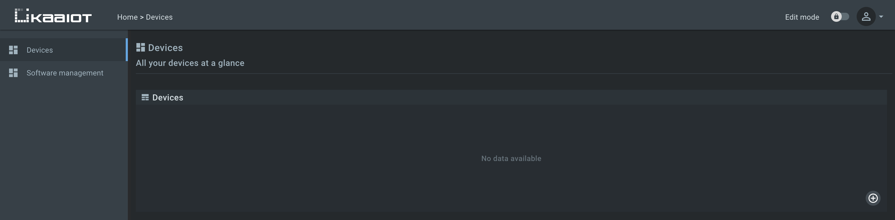
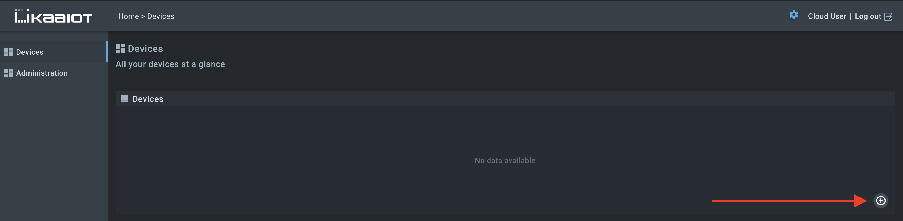
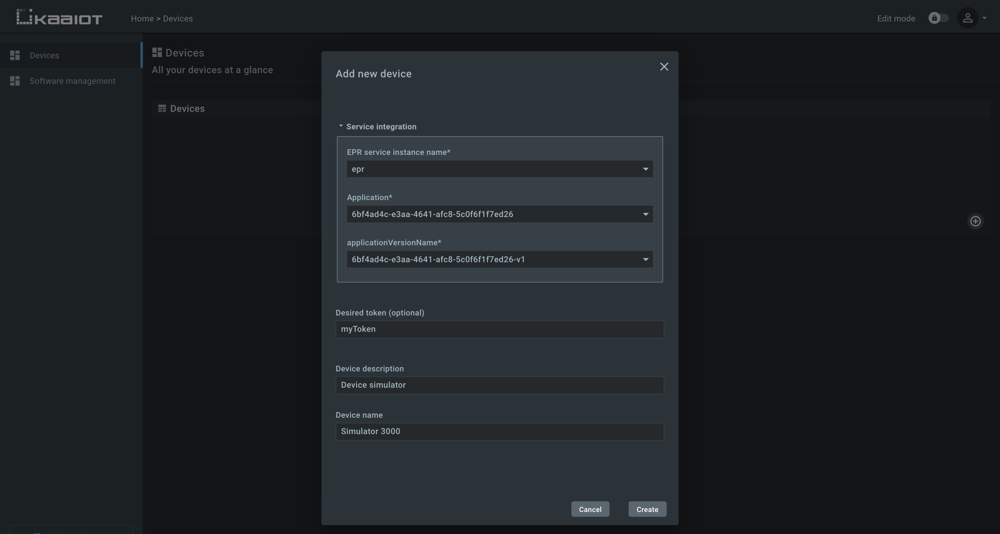
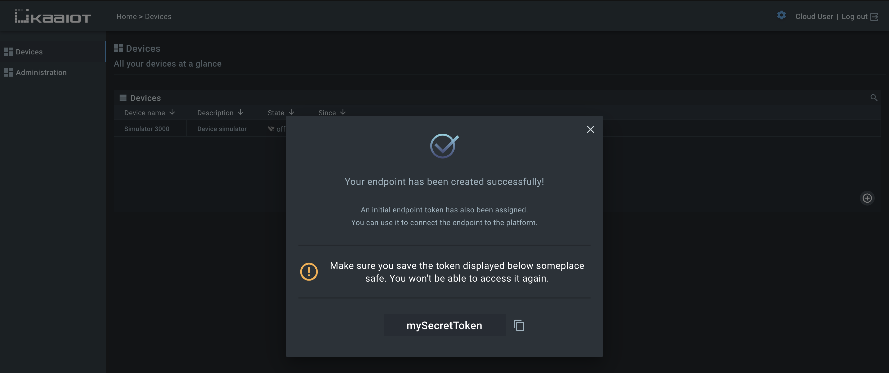
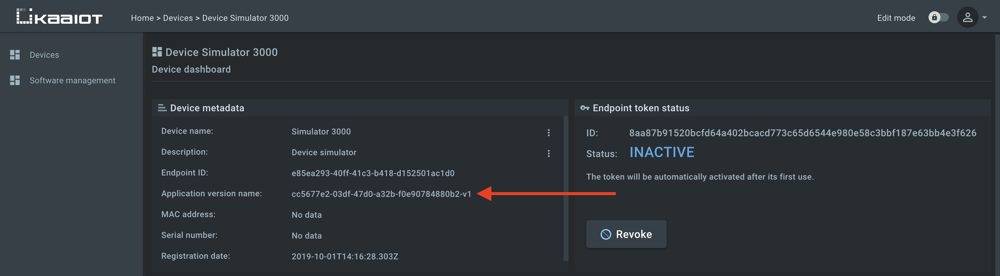
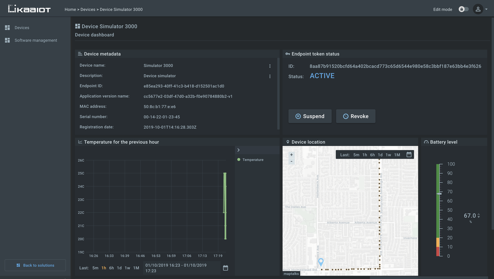






* TOC
{:toc}


## Overview

In this tutorial, we will look at how to get started with the [Kaa Cloud]({{kaa_cloud_url}}) in two simple steps:
1. Connect a [device simulator](https://repl.it/@ElenaOlkhovyk/SimulateEndpointTelemetryData) to the Kaa Cloud server.
2. Send and visualize the device simulated data on the [Web Dashboard][WD].


## Prerequisites

1. You have an account on the [Kaa Cloud]({{kaa_cloud_url}}).


## Playbook

To help you get started with the Kaa Cloud real quick, we've created a [Python simulator](https://repl.it/@ElenaOlkhovyk/SimulateEndpointTelemetryData) that connects to the platform and simulates a real device behavior, as follows: 

**1**. The simulator sends the following metadata to the platform on its start.

```json
{
    "serial": "00-14-22-01-23-45",
    "mac": "50:8c:b1:77:e8:e6"
}
```

**2**. The simulator sends telemetry data of the following format every 10 seconds.

```json
{
    "timestamp": 1569836796860,
    "temperature": 23,
    "log": "Randomly generated string: YjZgn3IbM6",
    "latitude": 37.34929,
    "longitude": -122.03247,
    "battery_level": 78.7
}
```

where: 
- `timestamp` - the current timestamp;
- `temperature` - a random number in the range of 20-25;
- `log` - a string with a randomly generated last part;
- `latitude` - latitude taken from the [file]({{code_url}}/location.json);
- `longitude` - longitude taken from the [file]({{code_url}}/location.json);
- `battery_level` - a number in the range of 0-100.

**3**. The simulator listens to the `HEALTH_CHECK` [command][commands] and responds with the following telemetry data upon receiving it.

```json
{
    "log": "Endpoint health status: OK"
}
```

<br/>

By default, a Kaa Cloud account is shipped with the preconfigured dashboards and widgets that visualize the above simulator data.
Also, the account includes pre-provisioned [endpoint filters]({{docs_url}}EPR/docs/current/Key-service-features/Ep-filters/) and [software (firmware) definitions][ota].

<br/>

Now let's proceed with the instructions to get you going.

**1**. Go to the "Devices" dashboard in your [Kaa Cloud account]({{kaa_cloud_url}}).



As you can see from the empty [Endpoint List widget]({{docs_url}}WD/docs/current/Widgets/Ep-list/), there are no connected devices yet. 
Let's connect one.

<br/>

**2**. Register the device digital twin. It's called "[endpoint][endpoint]" in Kaa.



<br/>

**3**. Enter the desired device name, and description and click `Create` button.



<br/>

**4**. Copy and save the [endpoint token][endpoint-token] in some file because **you won't be able to see it again in the future**.
We will use the token in a bit to connect the simulator.



<br/>

**5**. Go to the dashboard of the recently created endpoint (by clicking on the corresponding row in [Endpoint List widget]({{docs_url}}WD/docs/current/Widgets/Ep-list/) and copy its [application version][application].



<br/>

**6**. Open the simulator by [this link](https://repl.it/@ElenaOlkhovyk/SimulateEndpointTelemetryData), enter the `app_version_name` and the device `token` which you have saved in the previous steps and run the simulator in the sandbox.

After accomplishing the current step, you should see the simulator logs.

```text
DEBUG: Composed data collection topic: kp1/6bf4ad4c-e3aa-4641-afc8-5c0f6f1f7ed16-v1/dcx/myToken/json/47
INFO: Connecting to KPC instance at cloud.kaaiot.com:30900...
INFO: Successfully connected
INFO: Sent metadata: {"serial": "00-14-22-01-23-45", "mac": "50:8c:b1:77:e:e6"}

DEBUG: myToken: Sent next data sample: [{"battery_level": 100.0, "temperature": 20, "timestamp": 1568807610661, "longitude": -122.03248, "latitude": 37.35119, "log": "Randomly generated string: UOL759IEKH"}]
INFO: Message received: topic [kp1/6bf4ad4c-e3aa-4641-afc8-5c0f6f1f7ed16-v1/dcx/myToken/json/47/status]
body []
DEBUG: myToken: Sent next data sample: [{"battery_level": 100.0, "temperature": 23, "timestamp": 1568807613666, "longitude": -122.03247, "latitude": 37.35077, "log": "Randomly generated string: QP3F8T7QJS"}]
INFO: Message received: topic [kp1/6bf4ad4c-e3aa-4641-afc8-5c0f6f1f7ed16-v1/dcx/myToken/json/47/status]
body []
```

<br/>

**7**. Go back to the dashboard of the recently connected endpoint and view the simulated data.



<br/>

Congratulations, you have connected your first device simulator to the Kaa Cloud! We encourage you to experiment with the simulator source code, modify the dashboards, and get back to us with the feedback!

<br/>

Explore the "Software management" dashboard and get acquainted with its capabilities. 

## Next steps

- [Communication][communication] - find out what is under the hood of the Kaa platform communication layer.
- [Device management][identity] - learn how the Kaa platform device management feature works.
- [Data collection][data collection] - learn how the Kaa platform data collection feature works.
