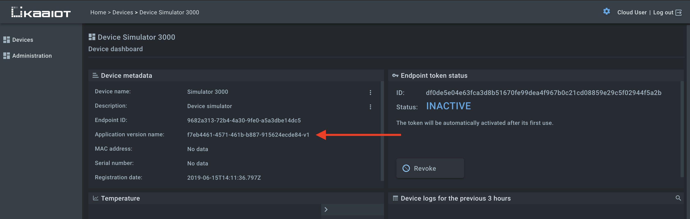
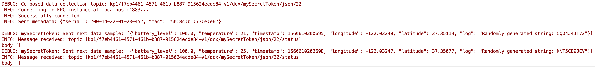
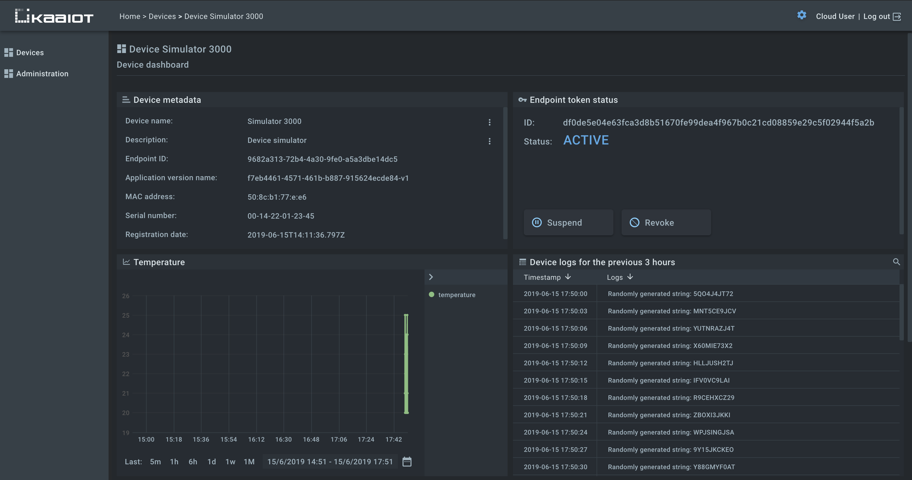






* TOC
{:toc}


# Overview

<!--todo: return link to cloud-->
In this tutorial we will look at how to get started with Kaa Cloud:
1. How to connect a [device simulator]({{code_url}}/client.py) to the Kaa Cloud server.
2. How to send and visualize device simulated data in [Web Dashboard](https://docs.kaaiot.io/WD/docs/current/Overview/).


# Prerequisites
<!--todo: return link to cloud-->
1. You have an account on Kaa Cloud.
3. [Python 2.7](https://www.python.org/download/releases/2.7/) is installed on your machine.


# Playbook
<!--todo: return link to cloud-->
**1**. Let's go to devices dashboard in your Kaa Cloud account.


As you can see from empty [Endpoint List widget]({{docs_url}}/WD/docs/current/Widgets/Ep-list/), there are no connected devices yet. 
Let's connect one.

**2**. Clone device simulator from [here]({{code_url}}).

The simulator consists of two files: 
- [client.py]({{code_url}}/client.py) - device simulator code written in Python 2.7.
- [location.json]({{code_url}}/location.json) - geographical location data for device live location simulation.

**Both files must be placed together in one directory.**

**3**. Register device digital twin, which is called "[endpoint][endpoint]" in Kaa terminology, in Kaa Cloud.


Enter the desired endpoint token, device name and description. You will use the token in a bit to connect your device. You can leave the token empty and let Kaa generate one for you.
  


Remember the endpoint token – we will need it later.


**4**. Go to the dashboard of the just created endpoint and copy its application version.



**5**. Run the cloned simulator from a terminal.

Enter the directory with the cloned simulator (where `client.py` and `location.json` files are located). 
Enter the next command replacing `{mySecretToken}` and `{myAppVersionName}` with your token and application version name respectively:

```bash
$ python --token {mySecretToken} --appVersionName {myAppVersionName} client.py
```

After hitting the command you should see simulator logs.



**6**. Go back to dashboard of the just connected endpoint and view simulated data.




Congratulations, you have connected your first device simulator to the Kaa Cloud! We encourage you to experiment with the simulator source code, modify the dashboards, and get back to us with the feedback!


# Next steps

- [Data collection tutorial][data collection tutorial]. 
