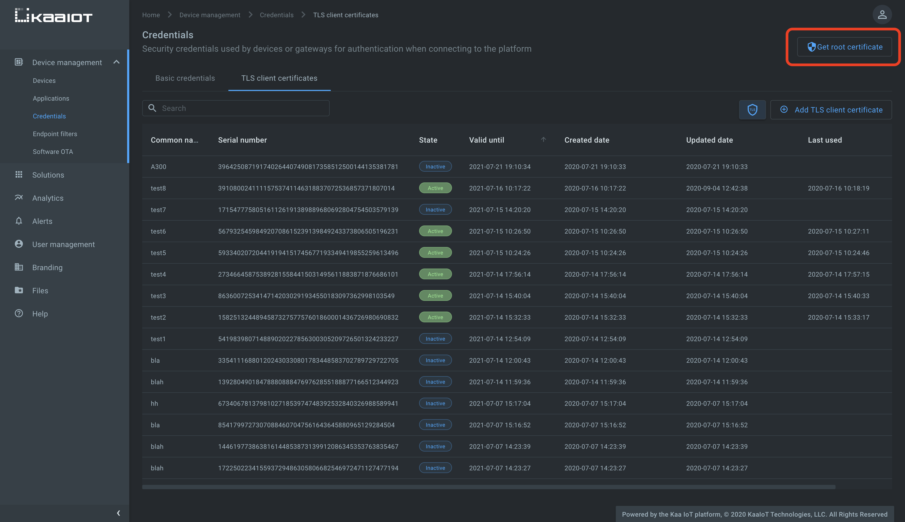
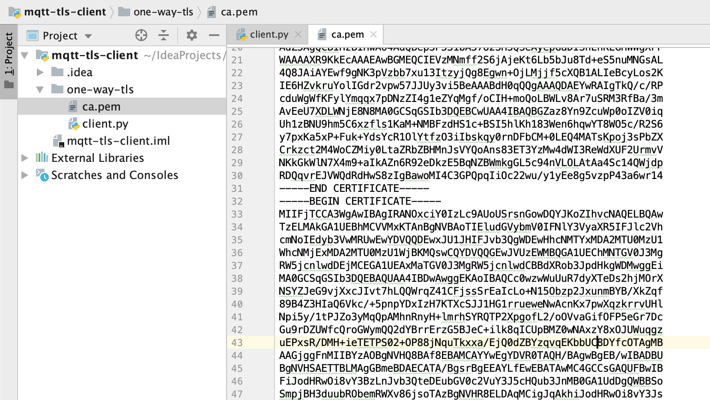
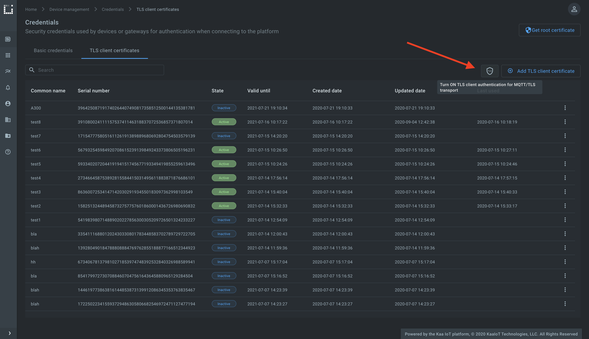
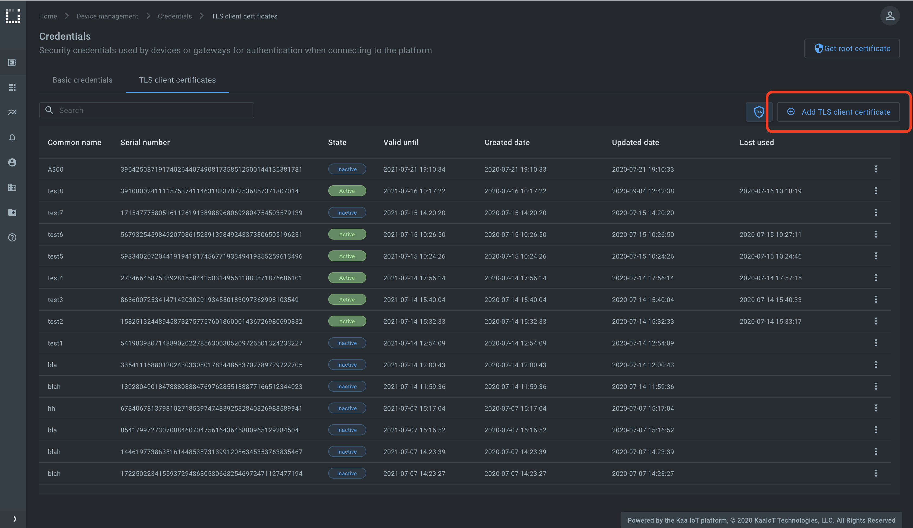
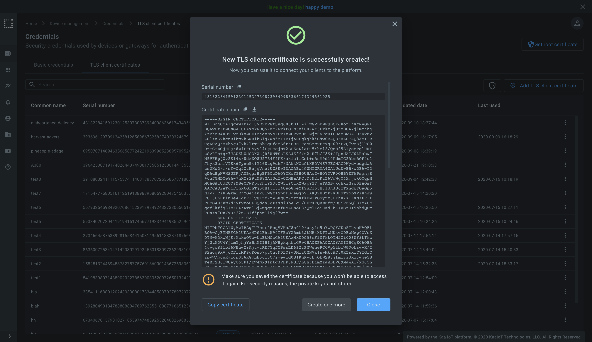
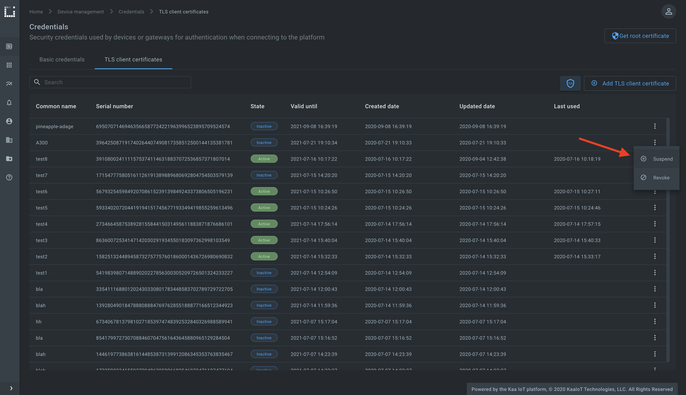




* TOC
{:toc}

Based on the [*Kaa v1.2*][whats new in 1.2].

Time to complete: *10 min*.


<!-- TODO: add video link

<div align="center">
  <iframe width="640" height="385" src="https://www.youtube.com/" frameborder="0"
          allow="accelerometer; autoplay; encrypted-media; gyroscope; picture-in-picture" allowfullscreen></iframe>
</div> --->


## Overview

Welcome to the fifth tutorial in the Kaa getting started guide!

From this tutorial you will learn some additional concepts of the Kaa platform and discover how to:

* communicate with the platform over **one-way** and **two-way** (mutual) MQTT over SSL/TLS
* **authenticate [client][client]** (or device) using X.509 certificate
* **suspend/revoke/reactivate** client X.509 certificate


<a id="one-way-ssl-tls-communication-anchor"></a>
## One-way SSL/TLS communication

In one way SSL, only client validates the server to ensure that it receives data from the intended server.
Accepting connection on MQTT over TLS port (`8883` by default), Kaa server sends its public certificate to the client.
Then client validates received certificate through certification authority (CA) or through its own trust store.


### Playbook

Let's play with the one-way SSL/TLS communication connecting MQTT client to the `8883` port which serves MQTT over TLS.
**Do not confuse** with the `1883` port which by contrast serves plain, not encrypted MQTT.

We assume that you have already created an application, application version, and endpoint with a token while following the ["connecting your first device" tutorial][connecting your first device].
You can reuse them or create new ones.

Start by logging into your [Kaa Cloud account][Kaa cloud].

To get Kaa server root certificate, go to the **Device management**, **Credentials**, click **Get root certificate** and copy the certificate content.



Create a file called `ca.pem` on your filesystem and paste copied root certificate.

To run the below MQTT client on your PC, you will need [Python 3][python download] installed.
To speed things up a little, you can also just [open it on Repl.it][one way authenticating client with tls certificate repl], and paste copied certificate there into empty file `ca.pem`.

The bellow client was taken from the ["Collecting data from a device"][collecting data from a device] tutorial and upgraded to communicate over MQTT over SSL/TLS.
Create the `client.py` file with the bellow content and place it in the same folder as `ca.pem`.

```python

```

Now you should end up with the folder with two files - one with Kaa server root certificate (`ca.pem`) and another one with Python MQTT client (`client.py`).



Initialize the `ENDPOINT_TOKEN` variable with the endpoint token, `APPLICATION_VERSION` with the endpoint application version and run the `client.py` Python script.
Verify that telemetry chart on the device dashboard is filled in with data.


Congrats, you have set up one-way SSL/TLS communication!
It's time to upgrade your skills to the two-way SSL/TLS communication which is even more secure comparing to the one-way.

<br/>


## Two-way (mutual) SSL/TLS communication

In case of two-way SSL, both client and server authenticate each other to ensure that both parties involved in the communication are trusted.
Both parties share their public certificates to each other and then verification/validation is performed based on that.
With mutual SSL/TLS communication feature enabled, Kaa server starts data exchange only with those clients that presented trusted by Kaa certificate.


### Playbook

To enable mutual SSL/TLS communication feature go to the **Device management**, **Credentials**, **TLS client certificates** tab, click **shield icon** and turn on the TLS client certificate authentication for MQTT/TLS transport.



Now that the feature is enabled, Kaa immediately drops connections with clients that start data exchange without presenting trusted X.509 certificate.

To generate trusted by Kaa X.509 certificate/key pair, click **Add TLS client certificate**, enter optional Common Name (CN), TTL and click **Create**.



The pop-up with certificate chain and private key must appear.



Create the file called `client.crt` on your filesystem with the content of the **Certificate chain** field from the pop-up.
Then create the file called `client.key` with the content of the **Private key** field from the pop-up.

We assume that you have already created the `ca.pem` with the Kaa server root certificate as described above in the [one-way SSL/TLS communication](#one-way-ssl-tls-communication-anchor) section so create it if you haven't done it yet.

To run the below MQTT client on your PC, you will need [Python 3][python download] installed.
To speed things up a little, you can also just [open it on Repl.it][two way authenticating client with tls certificate repl], and paste copied server root certificate, client certificate and private key there into empty files called `ca.pem`, `client.crt` and `client.key` respectively.

Create the `client.py` file with the bellow content and place it in the same folder as `ca.pem`, `client.crt` and `client.key`.

```python

```

Now you should end up with the folder with four files:
* Kaa server root certificate - `ca.pem`
* client certificate - `client.crt`
* client private key - `client.key`
* Python MQTT client - `client.py`


Initialize the `ENDPOINT_TOKEN` variable with the endpoint token, `APPLICATION_VERSION` with the endpoint application version and run the `client.py` Python script.
Verify that telemetry chart on the device dashboard is filled in with data.


### TLS client certificate state management

Client X.509 (TLS) certificates can have one of the bellow states:

* _Inactive_ is the initial state for newly provisioned certificate that has not been used to authenticate a client.
* _Active_ is the state certificate automatically move to after it was first used for client authentication. 
Certificate can be suspended or revoked from the active state.
* _Suspended_ state is for temporarily disabled certificate. 
Kaa rejects authentication requests with suspended certificate. 
Suspended certificate can be re-activated.
* _Revoked_ state is the terminal state for certificate that is no longer valid.

Go to the **Device management**, **Credentials** page, find later generated certificate that is used by the running MQTT client and suspend it.



Check running MQTT client, it must be disconnected.
Note that the platform automatically **disconnects** all clients that were using a certificate in the moment of its suspension or revocation.


## Resources

All the tutorial resources are located on [GitHub][code url].


## Feedback

This tutorial is based on Kaa 1.2 released on July 6-th, 2020.
If you, our reader from the future, spot some major discrepancies with your current version of the Kaa platform, or if anything does not work for you, please [give us a shout][Kaa user chat] and we will help!

And if the tutorial served you well, we'd still love to hear your feedback, so [join the community][Kaa user chat]!

<br/>
<div style="display: flex; justify-content: space-between;">
<div>
<a class="free_trial__button" href="{{open_distro_alerting}}"><< Open Distro alerting</a>
</div>
<div>
<a class="free_trial__button" href="{{custom_web_dashboard}}">Custom web dashboard >></a>
</div>
</div>

[code url]: https://github.com/kaaproject/kaa/tree/rel_1.2.0/doc/Tutorials/getting-started/tls-certificate-client-communication/attach/code
