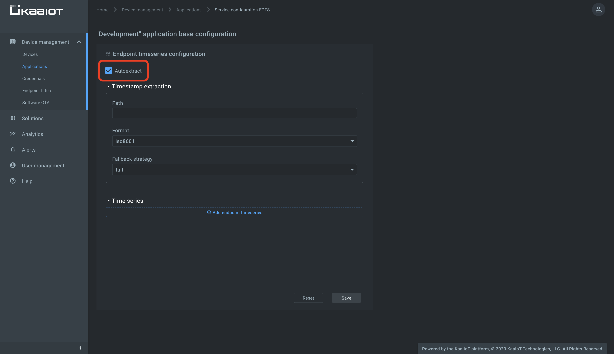
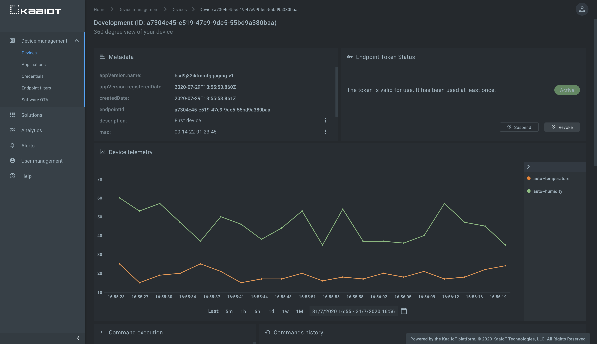




* TOC
{:toc}

Based on the [*Kaa v1.2*][whats new in 1.2].

Time to complete: *10 min*.


<!-- TODO: add video link

<div align="center">
  <iframe width="640" height="385" src="https://www.youtube.com/" frameborder="0"
          allow="accelerometer; autoplay; encrypted-media; gyroscope; picture-in-picture" allowfullscreen></iframe>
</div> --->


## Overview

Welcome to the second tutorial in the Kaa getting started guide!
We assume that you have successfully connected your first device to Kaa, so make sure to [review the first tutorial][connecting your first device] before proceeding here.

From this tutorial you will learn some additional concepts of the Kaa platform and discover how to:

* collect telemetry data from a device
* transform raw telemetry data into well-structured [time series](https://en.wikipedia.org/wiki/Time_series)
* use the time series auto-extraction feature
* visualize time series data on the Kaa UI


## Terms and concepts

Let us start by reviewing some new terms and concepts related to the Kaa data collection feature.


### Data sample

Think of **data sample** as a block of data in JSON format that a client sends to the platform for data collection.

Let's consider an example.

You have a greenhouse monitoring station that consists of temperature, humidity and light sensors, and a gateway (e.g. Arduino) that all sensors are connected to.
Every minute Arduino polls all connected sensors for their current values.
Then the Arduino formats sensor values into a [JSON][json] object: this is a data sample.

```json
{
  "temperature": 25,
  "humidity": 46,
  "lux": 8600
}
```


### Time series

**Time series** is a named sequence of data points.
Each data point contains a timestamp and one or more named values.
A set of value names and their types (numeric, string, boolean) defines a time series.

You may want different time series defined for various things.
For example, a fuel level time series may only have one numeric value: `level`.
On the other hand, a geo-location time series may have several numeric values: `latitude`, `longitude`, and in some applications `altitude`.

You can configure Kaa to transform data samples received from endpoints into time series for displaying them on charts, gauges, maps, etc.
The microservice responsible for extracting data points from data samples, storing and retrieving them, is the [Endpoint Time Series service (EPTS)][EPTS].
It can use a timestamp present in a data sample or use a data sample receipt timestamp.
For simplicity, in this tutorial we will use data receipt timestamps.

Also, EPTS has an auto-extraction feature that stores each numeric top-level data sample field into a separate time-series.
All auto-extracted time series have a name that follows the pattern `auto~<field name>` and one numeric value with the name `value`.
So, if your endpoint sends data a sample with two fields, e.g.:

```json
  {
    "temperature": 23,
    "humidity": 48
  }
```

and the auto-extraction feature is enabled, EPTS creates two time-series: `auto~temperature` and `auto~humidity`. 

Let's now send some data to Kaa and see the auto-extraction feature in action.


## Playbook

We assume that you have already created an application, application version, and endpoint with a token while following the ["connecting your first device" tutorial][connecting your first device].
You can reuse them or create new ones.

Start by logging into your [Kaa Cloud account][Kaa cloud].


### Enable the time series auto-extraction

To keep things simple, at this time we will not define any configurable time series, but rather just use the EPTS auto-extraction feature.
Let us make sure that it is turned on in your application.
Go to the Device management -> Applications -> expand your application -> select "epts" and enable the "Autoextract" checkbox.



With this function enabled, Kaa will automatically create a time series for each numeric field it encounters at the root of data samples your endpoints in this application will submit.
You will then be able to view these time series in Kaa UI, no extra configuration required.

Go to the pre-defined endpoint dashboard and scroll to the "Device telemetry" widget.
(The endpoint dashboard is available from Device management -> Devices -> select your endpoint in the list.)
Now we are all set to send our first data sample to the platform.


### Send data samples

You can submit telemetry data via a variety of MQTT- and HTTP-based interfaces.
Let's take a look at a couple of the simplest ones: plain HTTP and plain MQTT.

<ul class="nav nav-tabs">
  <li class="active"><a data-toggle="tab" href="#http-client">HTTP</a></li>
  <li><a data-toggle="tab" href="#mqtt-client">MQTT</a></li>
</ul>

<div class="tab-content"><div id="http-client" class="tab-pane fade in active" markdown="1"><br>

Execute the below [cURL][curl] command to send one data sample with `temperature` and `humidity` fields.
You can run this command several times to get multiple data points shown as a line in the Kaa UI.

Remember to replace `<app-version-name>` and `<endpoint-token>` with your application version name and the endpoint token respectively.

```bash
curl --location --request POST 'https://connect.cloud.kaaiot.com:443/kp1/<app-version-name>/dcx/<endpoint-token>/json' \
--data-raw '{
  "temperature": 23,
  "humidity": 48
}'
```

</div><div id="mqtt-client" class="tab-pane fade" markdown="1"><br>

To run the below MQTT client on your PC, you will need [Python 3][python download] installed.
To speed things up a little, you can also just [open and run it on Repl.it][collecting data from a device repl 1.3].

Remember to initialize `APPLICATION_VERSION` and `ENDPOINT_TOKEN` variables your application version name and the endpoint token respectively.

```python

```

Feel free to play with the client and use it as a reference for your client integration.

</div></div>

Verify that the `auto~temperature` and `auto~humidity` time series appeared on the right side of the "Device telemetry" chart and the chart is filled with data points.




## Resources

All the tutorial resources are located on [GitHub][code url].


## Feedback

This tutorial is based on Kaa 1.2 released on July 6-th, 2020.
If you, our reader from the future, spot some major discrepancies with your current version of the Kaa platform, or if anything does not work for you, please [give us a shout][Kaa user chat] and we will help!

And if the tutorial served you well, we'd still love to hear your feedback, so [join the community][Kaa user chat]!

<br/>
<div style="display: flex; justify-content: space-between;">
<div>
<a class="free_trial__button" href="{{connecting_your_first_device}}"><< Connecting your first device</a>
</div>
<div>
<a class="free_trial__button" href="{{sending_commands_to_device}}">Sending command to a device >></a>
</div>
</div>

[code url]:           https://github.com/kaaproject/kaa/tree/rel_1.3.0/doc/Tutorials/getting-started/collecting-data-from-a-device/attach/code
