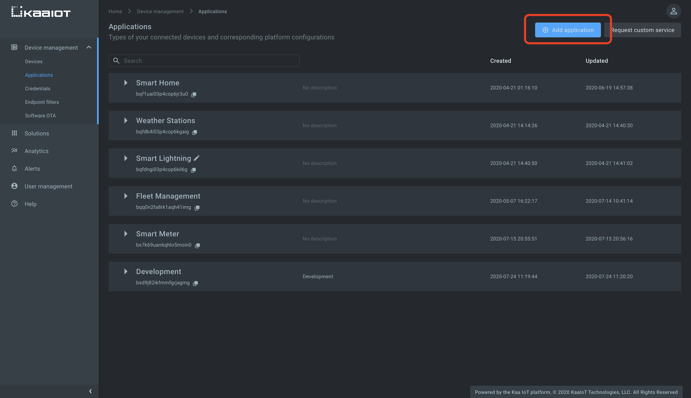
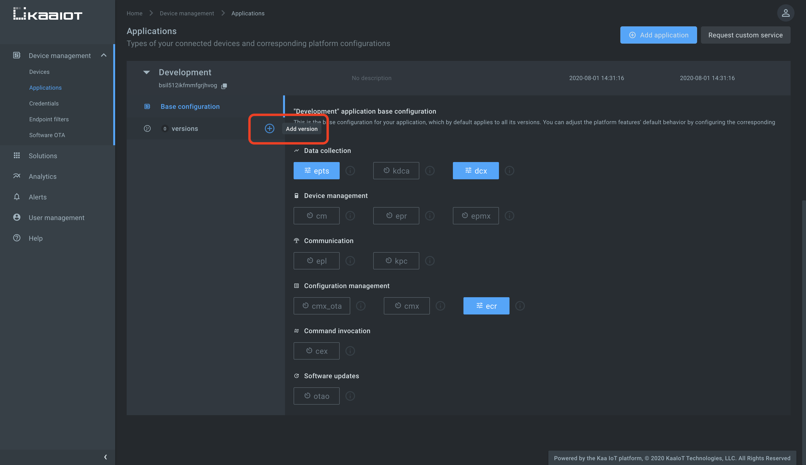
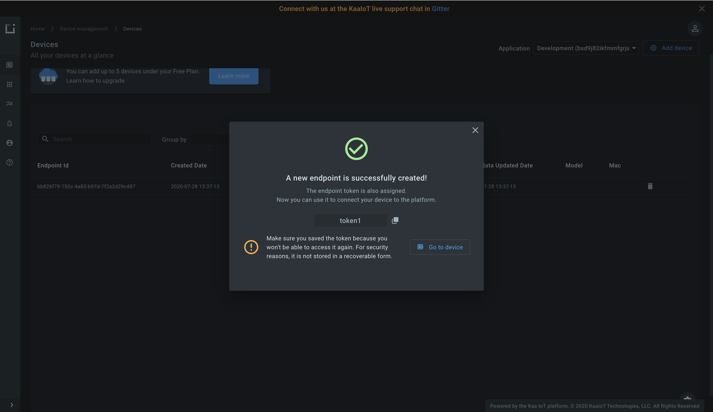
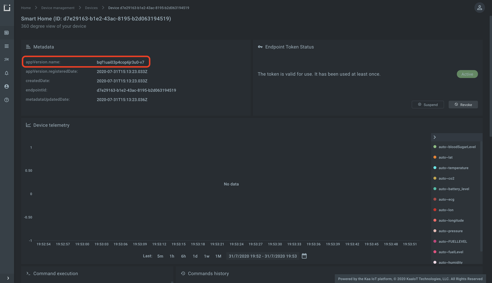
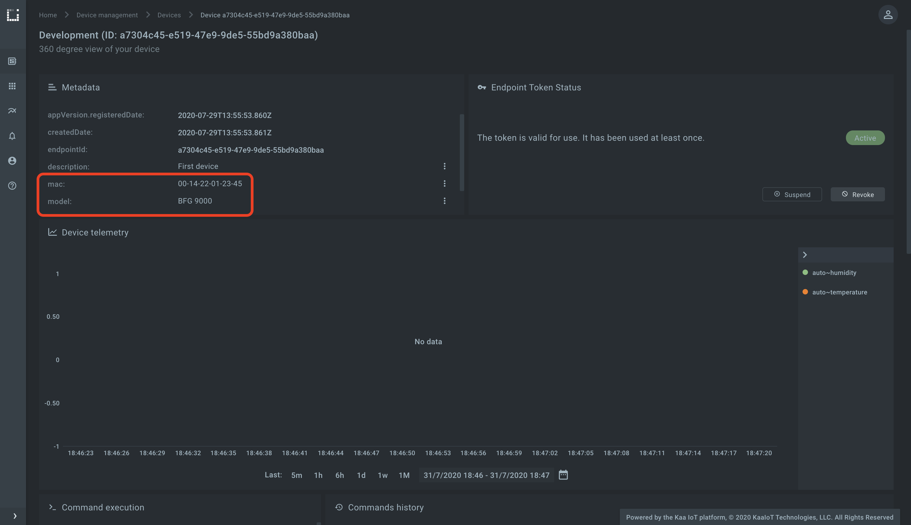




* TOC
{:toc}

Based on the [*Kaa v1.2*][whats new in 1.2].

Time to complete: *12 min*.


<div align="center">
  <iframe width="640" height="385" src="https://www.youtube.com/embed/B-OgeYsPlFM?rel=0" frameborder="0"
          allow="accelerometer; autoplay; encrypted-media; gyroscope; picture-in-picture" allowfullscreen></iframe>
</div>


## Overview

Welcome to our first tutorial in the Kaa getting started guide!

From this tutorial you will learn some of the fundamentals of the Kaa platform and discover how to:

* create a digital twin of your IoT device
* connect a client
* submit and fetch some device attributes
* view the digital twin of your device and its attributes in the Kaa UI

To complete this tutorial, you will need an active account in the Kaa Cloud.
So, if you haven't signed up for a free account yet, [do so before proceeding here][Kaa cloud registration].


## Terms and concepts

Let's start by defining some of the essential Kaa terms.
They will help you get a good grasp of the Kaa design logic and provide for smooth transition  into the Kaa documentation, tutorials, UI, and API.


### Endpoint

**Endpoint** is a digital twin of something that you manage with the Kaa platform.
A lot of data in Kaa is related to endpoints: attributes, telemetry data, configuration, etc.
We often shorten "endpoint" to "EP", so don't get caught by surprise when you see something like "EP configuration" in the docs (you got it, documentation).

Most commonly, an endpoint represents some connected device: a weather station, camera, sub-gig RAN gateway, smart sock, or a submarine.
However, after a lot of debate, we decided in favor of a more generic term "endpoint" instead of "device" (even though we knew it would be more confusing for the Kaa beginners).
To understand why, let us consider some examples.

**Example 1: olive trees irrigation.**

In this use case, soil moisture sensors are deployed beside olive trees to monitor and optimize the soil humidity level.
Apparently, olive trees are the first-class citizens that the solution has to take care of---not the sensors.
So, it's quite reasonable to display a tree as a managed entity in the platform, even though it has no Ethernet port or WiFi.
We suspect that the trees are not even aware of the fact that they are monitored and somehow represented in Kaa.
It would be unfair to the trees to still call them "devices", so, "endpoints" seems to be a more appropriate turn of phrase.


**Example 2: medical supply chain management.**

In this application, Kaa is used to manage the lifecycle of temperature-sensitive drugs, from the factory to delivery.
Each batch of drugs flows through a factory process with multiple quality control points.
After the manufacturing is complete, a batch gets delivered to hospitals and medical centers.
 
Important process information, such as quality control logs and environmental temperature sensor readings, get automatically submitted to the platform and become available for examination.
This data is clearly associated with drug batches, and not the sensors and machines reporting them.
Similarly to the olive trees, it would be confusing to call drug batches "devices", so "endpoints" seemed like a more natural (though generic) fit.

As you may have realized from these examples, an endpoint in Kaa is not necessarily the same thing as the client device connected to the platform.
This is importand decoupling that makes it possible for connected clients to exchange data *on behalf of* endpoints.
For example, you can connect a gateway to Kaa and program it to submit data from multiple home appliances in the local network.
The appliances in this case may be modelled as individual endpoints.

Wrapping up this subject, we use "endpoints" across the platform and documentation to refer to a digital twin of something managed by the Kaa platform (most often IoT devices, but with exceptions).
We tend to use word "devices" rather colloquially to refer to actual physical objects.

Now that you are familiar with this important concept, let us quickly review some related terms.


### Endpoint ID

**Endpoint ID** is used to uniquely identify an endpoint within the Kaa platform.
An endpoint ID is usually an immutable [UUID][uuid] that is automatically generated by the Kaa at the moment of creating a new endpoint.

All endpoint data, such as metadata attributes, collected time series data points, commands, etc., is associated with a specific endpoint ID.
Whenever you retrieve or manage endpoint-related data in Kaa (mainly via REST API or NATS), you will see endpoint IDs.


### Endpoint token

**Endpoint tokens** are used for endpoint identification when exchanging endpoint-related data with the Kaa platform using supported out-of-the-box protocols based on [MQTT][mqtt] and HTTP.
Endpoint tokens are unique within a single [Kaa application][application] and assigned to exactly one endpoint.

When a message from a connected client arrives to the Kaa platform, endpoint token is resolved into the corresponding endpoint ID.
In the case of the Kaa Protocol over MQTT, the endpoint token goes inside of the MQTT topic (e.g. `kp1/<appversion_name>/epmx/<endpoint_token>/get`).

Typically, tokens are random strings automatically generated by Kaa (e.g. `JTjdbENzHh`), but you can also provision your own endpoint tokens (e.g. device serial number, MAC address, etc.).

Decoupling of endpoint tokens from endpoint IDs allows you to suspend, revoke, reactivate, and re-issue endpoint tokens without impacting the endpoint ID.
To communicate with the Kaa platform, your devices or gateways do not need to know endpoint IDs, but only endpoint tokens.


### Endpoint metadata

**Endpoint metadata** is a set of key-value attributes associated with an endpoint.
It is represented in the platform as a JSON document of an arbitrary format.

Endpoint metadata typically includes some endpoint-related information, such as location, description, serial number, hardware version, etc. 
Metadata is stored in the [Endpoint Register service][EPR] and can be read or updated in two ways: either via the [communication layer][communication] or via the [EPR REST API][EPR REST API].
Certainly, you can also manage metadata using the Kaa [Web Dashboard][WD] UI.


### Applications and application versions

Let's imagine for a moment that you have already implemented and successfully launched a line of smart IoT-powered fridges.
The business is good; but now you figure it's time to expand your product portfolio with connected coffee machines.
But how do you distinguish between fridges and coffee machines in the platform?

Enter **Kaa applications**.

Applications in Kaa serve as containers for endpoints of different types.
You can have a "Smart fridge" application that would contain all endpoints representing physical fridges, and a "Coffee machine" application for all, well, coffee machines.
Kaa applications also house all the necessary system configuration for Kaa to know the capabilities of your connected devices and how to work with them.
For example, coffee machines may have a setting for the brewing temperature.
This configuration setting can be declared in the Kaa "Coffee machine" application, so that the platform understands it.

Now, back to our home appliances business.
Let's imagine that your new coffee machines sell exceptionally well but you keep hearing about this new feature that customers want.
They want to wake up to the smell of freshly brewed coffee.
To enable this, you implement a new feature in the app that allows users to schedule the time of auto-start.
There is also an update to the coffee machines firmware and you start rolling it out.
But how do you distinguish between machines that already have the new firmware and those which don't?

**Application versions** to the rescue.

Each application in Kaa can have multiple versions at the same time.
Each version represents a set of capabilities supported by endpoints.
At any given moment each endpoint in Kaa is associated with one version of its application.
The knowledge of the current application version of an endpoint helps Kaa understand what functionality the endpoint supports, how the data is formatted, etc.
You can use versions to evolve your devices by adding or retiring features while keeping your old versions up and running.

Application version names are present in the default Kaa protocol to make the platform aware of the capabilities of the connected endpoint (e.g. `kp1/<appversion_name>/epmx/<endpoint_token>/get` topic over MQTT).

You may notice that we often shorten "application version" to "appversion".
That's just a developer's habit, we hope you don't mind.

Now that we are done with the textbook part, let's jump into action and do something fun.


## Playbook

Log into your [Kaa Cloud account][Kaa cloud] and follow the steps below to register your first digital twin and connect a client to exchange some endpoint metadata.


### Create a Kaa application and version

As you know from a [previous section](#applications-and-application-versions), to register an endpoint in Kaa you need an application and a version.
You can manage them in the Kaa UI under the "Applications" section.
Navigate there and use the "Add application" button.



Now that you have an application, time to create your first application version.



Remember that both applications and versions have:

* auto-assigned and immutable **names** that usually look like `7bfdd6b9-ff44-4098-a4dc-58c0f3c9f693` and `7bfdd6b9-ff44-4098-a4dc-58c0f3c9f693-v1`: you will use these for API calls, client integration, etc.
* arbitrary **display names** that you are free to change at any time.
  These display names are used in the platform UI for your convenience.
  `Smart sock` and `Olive tree v1` are both good examples that capture the essence of things you manage with Kaa.


### Create a digital twin (endpoint)

Go to the ["Devices" dashboard][devices dashboard] and add an endpoint.
You can also pre-populate the endpoint metadata with some values, like we did with the `description` attribute below.


Note the endpoint token: you will it need to complete the integration.




### Connect a client

Now that you have created your first endpoint, it's time to connect a client and fetch / submit some endpoint metadata.

As of Kaa 1.2, the platform supports various flavors of MQTT- and HTTP-based protocols for connecting your clients.
For simplicity, we will show you how to use plain HTTP or MQTT in this tutorial.
You will find out more about secure communication using TLS in future tutorials.

In case of both HTTP and MQTT, to complete the client integration you will need the application version name and the endpoint token.
They go into the HTTP URL and MQTT topic, so that the platform is able to identify your endpoint and the current application version that the endpoint supports.

You should already have the token from the previous step.

As for the currently registered endpoint application version, you can find it from the endpoint dashboard.
Go to the "Devices" dashboard and click on your endpoint record.



Now let us see how you can fetch and submit endpoint metadata from your client using your preferred integration protocol.

<ul class="nav nav-tabs">
  <li class="active"><a data-toggle="tab" href="#http-client">HTTP</a></li>
  <li><a data-toggle="tab" href="#mqtt-client">MQTT</a></li>
</ul>

<div class="tab-content"><div id="http-client" class="tab-pane fade in active" markdown="1"><br>

To retrieve all endpoint metadata attributes from the platform using [cURL][curl], send a request as shown below.
Remember to replace `<app-version-name>` and `<endpoint-token>` with your application version name and the endpoint token respectively.

```bash
curl --location --request POST 'https://connect.cloud.kaaiot.com:443/kp1/<app-version-name>/epmx/<endpoint-token>/get' \
--data-raw '{}'
```

To report some endpoint metadata attributes to the platform:

```bash
curl --location --request POST 'https://connect.cloud.kaaiot.com:443/kp1/<app-version-name>/epmx/<endpoint-token>/update/keys' \
--data-raw '{
    "model": "BFG 9000",
    "mac": "00-14-22-01-23-45"
}'
```

Alternatively, you can run these and other HTTP-based operations on endpoint metadata using <a href="{{1kp_over_http_postman_collection}}" download>this Postman collection</a>.

Of course, we do not suggest that you run cURL or Postman in your award winning smart fridges---rather treat these as a reference for your HTTP-based integration with Kaa.

</div><div id="mqtt-client" class="tab-pane fade" markdown="1">
<br/>

To run the below MQTT client on your PC, you will need [Python 3][python download] installed.
To speed things up a little, you can also just [open and run it on Repl.it][connecting your first device repl].

Remember to initialize `APPLICATION_VERSION` and `ENDPOINT_TOKEN` variables your application version name and the endpoint token respectively.

```python

```

Feel free to play with the client and use it as a reference for your client integration.

</div></div>

Let us now look at the endpoint page to make sure that the reported `mac` and `model` attributes are available in the platform.



Congratulations!
You have completed the first getting started with Kaa guide, learned how to create a digital twin of your device, connect a client, retrieve existing metadata from the platform, and report new metadata attributes.

<!-- TODO: add next steps, like a link to the next tutorial in the series -->


## Resources

All the tutorial resources are located on [GitHub][code url].


## Feedback

This tutorial is based on Kaa 1.2 released on July 6-th, 2020.
If you, our reader from the future, spot some major discrepancies with your current version of the Kaa platform, or if anything does not work for you, please [give us a shout][Kaa user chat] and we will help!

And if the tutorial served you well, we'd still love to hear your feedback, so [join the community][Kaa user chat]!

<br/>
<div style="display: flex; justify-content: space-between;">
<div>
</div>
<div>
<a class="free_trial__button" href="{{collecting_data_from_a_device}}">Collecting data from a device >></a>
</div>
</div>

[code url]:           https://github.com/kaaproject/kaa/tree/rel_1.2.0/doc/Tutorials/getting-started/connecting-your-first-device/attach/code
[devices dashboard]:  https://cloud.kaaiot.com/devices/device-management
