


* TOC
{:toc}


## Overview

In this tutorial, you will learn how to connect and use a custom widget in the Kaa web UI. We will create a custom widget that can be used to control any single configuration value of your device, for example, voltage, temperature, humidity, cruise control of a car, etc.

We will go through the following steps:
- Create a simple widget that works with [ECR][ECR] service and allows updating the device configuration;
- Connect the widget to the Kaa web UI;
- Add the widget to the Kaa web dashboard and use it.


## Prerequisites

You need to have the following tools installed:
- [Node.js](https://nodejs.org/uk/) >= 15;
- [npm](https://docs.npmjs.com/) 6.0.0 or later;
- [git](https://git-scm.com/)

Run the following commands to check the current Node.js and NPM versions:

```sh
  node -v
  npm -v
```

## Playbook

### Create a custom widget project

Let's assume that we need a custom widget for visualizing and updating the device configuration in the **Smart metering** solution.

These are the main requirements for our widget:
- it should enable us to display and update **the device-specific configuration** as well as **the default configuration per application version**;
- it should inherit its color palette from the current solution theme.

Let's start.

First of all, log in into the Kaa Web UI and go to the **Custom widgets** page

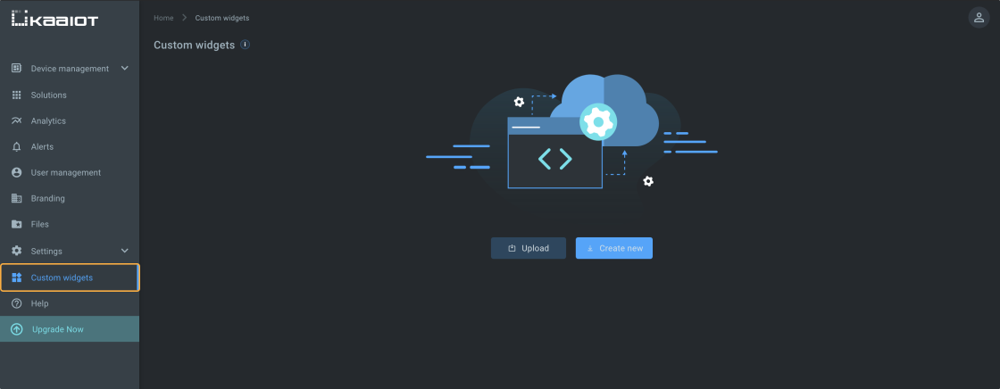

click **Connect and use**

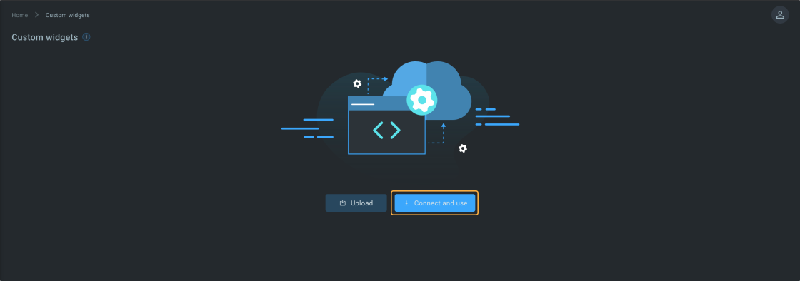

After this, you will see the pop-up with the instructions for quick start. Follow these instructions.

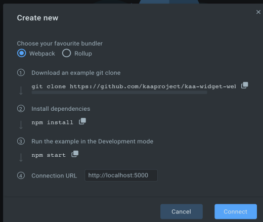

After you have cloned the plugin widget template, installed the packages, and started the local development server, your custom widget is ready to be plugged in to the Kaa web UI.

By default, the custom widget template project starts on the port 5000.

For this tutorial we will use the default local server configuration. 

Let's make sure that everything is fine at this point and we can proceed.

In order to be successfully connected to Kaa, our **localhost** development server should expose the following files from its root:
- **index.js** - this is our bundle file compatible with [System.js](https://github.com/systemjs/systemjs) module loader
- **widget.json** - contains the widget settings
- **preview image** - the widget preview

Check the following links: 

- **http://localhost:5000/index.js**
- **http://localhost:5000/widget.json**
- **http://localhost:5000/preview.svg**

All of these resources should be reachable now and we can plug in our new widget to the Kaa UI.

Moreover, we are going to expand our custom widget functionality to match the requirements we have and would like to test our updates in the Kaa UI.

This is what we are going to do next.

### Register custom widget

After our **local development server is up and running**, let's return to the Kaa UI. 

On the **Custom widgets** page, in the **Connect and use** popup, click **Connect**

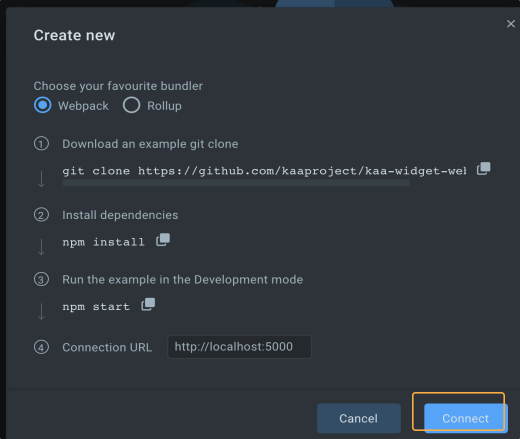

and then **Register**.

If you already have closed the **Connect and use** popup you can invoke it again by clicking the **Connect and use**. 

Now, the widget should be added to the widgets registry and we must be able to see it on the Custom widgets page.


First, we would like to rename our widget and update its custom preview image.

Let's open the widget editing dialog and make some changes:
- set __Package name__ to __@kaa/custom-configuration-widget__
- set __Widget name__ to __Custom configuration widget__
- select __Configuration management__ for __Category__
- upload the custom widget preview image, which may be taken from [here](https://github.com/kaaproject/kaa-custom-widget-tutorial/blob/master/src/assets/preview.svg).

Also, we need the capability to add our widget on the dashboards while under the development and to test its latest source version live on the dashboards. For that, enable **Development mode**.

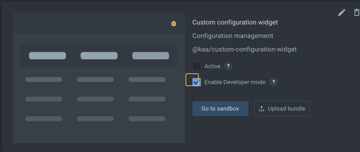

Now go to the **Smart metering** solution. If you do not have it yet, you may create it from the template.

In the __Smart metering__ solution on the device page add our new widget from the __Configuration management__ category

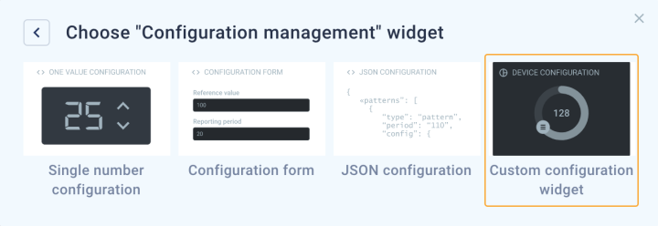

Now we should see the custom widget from the template on the dashboard.

### Custom widget development 

Let's customize the widget so that it looks like a circular slider and allows the user to update the device **Overdrive threshold** configuration parameter on [ECR][ECR].

It is important to note that Kaa widgets have two main components:
- functional/visual part;
- configuration settings, e.g., in our case: which ECR service instance the widget should work with, which device configuration parameter key it should update, etc. More information about the widget configuration can be found in the [widget configuration seection](#widget-configuration-overview).

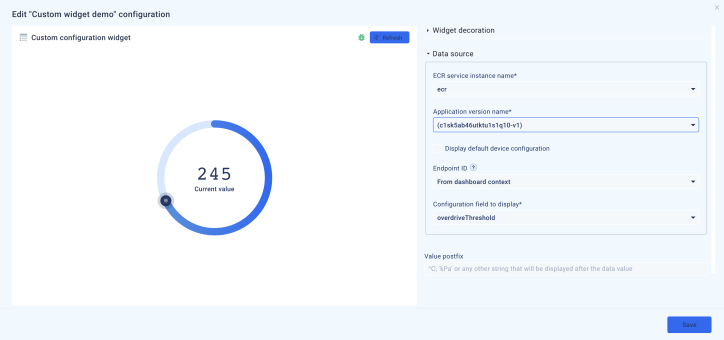

First, let's install the npm packages:

```sh
  npm i @fseehawer/react-circular-slider lodash
```

Now we will define the widget configuration schema. Afterwards, we will use this schema in the widget while implementing the widget behaviour (functionality).  

In our **Custom widget project** create the `/src/schemas/schema.ts` file and insert the following schema: [schema](https://github.com/kaaproject/kaa-custom-widget-tutorial/blob/master/src/schemas/schema.ts), then delete `schema.json` file in the same directory as we do not need it any more.

Update the `/src/schemas/uiSchema.ts` with the following content: [content](https://github.com/kaaproject/kaa-custom-widget-tutorial/blob/master/src/schemas/uiSchema.ts).

Define the widget configuration TypeScript type in `/src/types.ts`: [type](https://github.com/kaaproject/kaa-custom-widget-tutorial/blob/master/src/types.ts).

Now, that we are done with the **configuration** part, let's proceed to the widget functionality.

First, let's define a couple of helper functions so that we can use them while developing the main widget functionality.

Create `/src/device-configuration.ts` and insert the following contents: [device configuration utilities](https://github.com/kaaproject/kaa-custom-widget-tutorial/blob/master/src/device-configuration.ts)

and import them in `App.tsx`:

```js
  import {
    getDeviceCurrentSetting, extractDeviceConfig, extractEtagHeader, getThemeColors, setConfiguration, getConfiguration
  } from './device-configuration';
```

Now, we can concentrate on the widget's main functionality.

In the `/src/App.tsx` import the **ECR** client, a circular slider package and a couple of helper __Lodash__ functions:

```js
  import { createECRClient } from '@kaaiot/services';
  import CircularSlider from '@fseehawer/react-circular-slider';
  import _get from 'lodash/get';
  import _debounce from 'lodash/debounce';
```

Now let's initialize the ECR client in our component:

```js
  const ecrClient = useRef(createECRClient('/ecr'));
```

Also, set the initial state:

```js
  const [loading, setLoading] = useState(true);
  const [deviceConfigurationValue, setDeviceConfigurationValue] = useState(null);
  const [etag, setEtag] = useState<string>('');
```

As we can see, we have the **widgetService** property available in the **widget context**.

This is an instance of a widget SDK provider, which contains a number of useful methods for custom widget development.

In our case, we need to call a **widgetService.getWidgetConfig()** method to retrieve the following widget settings:
- Endpoint ID;
- Configuration data path;
- Application version name etc;

These are the configuration settings we defined in the `/src/schemas/schema.ts` and which will be filled by the widget user while configuring the widget on the dashboard UI. Besides the **configuration**, we will retrieve a couple of other parameters to local variables, which will be useful later:

```js
  const configuration = widgetService.getWidgetConfig();
  const configurationDataPath = configuration.serviceIntegration && configuration.serviceIntegration.dataPath;
  const themeColors = getThemeColors(widgetService.getTheme());

  const value = getDeviceCurrentSetting(deviceConfigurationValue, configurationDataPath);
```

Let's recollect one of our main widget requirements: it should enable us to display and update **the device-specific configuration** as well as **the default configuration per application version**;

Our **ecrClient** instance contains the corresponding methods to GET and PUT the device specific configuration as well as the default configuration.

So let's define the function to get the device configuration in the `/src/device-configuration.ts`:

```js
  interface GetConfigurationParams {
    client: ECRClient;
    configuration: WidgetConfig;
    etag: string;
  }

  export const getConfiguration = ({
    client,
    configuration,
    etag
  }: GetConfigurationParams) => {
    const endpointId = _get(configuration, 'serviceIntegration.endpointId');
    const appVersionName = _get(configuration, 'serviceIntegration.applicationVersionName');
    const isDefaultAppConfiguration = _get(configuration, 'serviceIntegration.defaultConfig');

    if (isDefaultAppConfiguration) {
      return client
        .getDefaultConfiguration({
          appVersionName,
          headers: {
            'If-None-Match': etag,
          }
        })
    }

    return client
      .getEndpointConfiguration({
        appVersionName,
        endpointId,
        headers: {
          'If-None-Match': etag,
        }
      });
  }
```

Above we can see a couple of new methods used:

- **getDefaultConfiguration({...})** - is the [ECR GET default configuration abstraction](https://docs.kaaiot.io/KAA/docs/v1.3.0/Features/Configuration-management/ECR/REST-API/#app_versions__appversionname__get) 

- **getEndpointConfiguration({...})** - is the [ECR GET endpoint configuration abstraction](https://docs.kaaiot.io/KAA/docs/v1.3.0/Features/Configuration-management/ECR/REST-API/#endpoints__endpointid__app_versions__appversionname__get).

Now, let's retrieve the device configuration on the widget mount event:

```js
  useEffect(() => {
    setLoading(true);

    getConfiguration({
      client: ecrClient.current,
      configuration,
      etag
    })
      .then((response) => {
        setLoading(false);
        const deviceConfig = extractDeviceConfig(response.data['config']);
        setEtag(extractEtagHeader(response.headers));
        setDeviceConfigurationValue(deviceConfig);
      })
      .catch((error) => {
        setLoading(false);
        setDeviceConfigurationValue(null);
        console.error("Error while retrieving the device configuration", error);
      });
  }, []);
```

Now, after we have already retrieved the device configuration and viewed it in the widget, let's output the **CircularSlider** component:


```tsx
  return (
    <div className="root">
      {
        value && !loading && (
          <CircularSlider
            width={250}
            label={configuration.postfix || 'Current value'}
            labelBottom
            labelColor={themeColors.textColors.colorPrimary}
            knobColor={themeColors.textColors.colorPrimary}
            trackColor={themeColors.elementColors.colorSurface2}
            progressColorFrom={themeColors.textColors.colorSecondary}
            progressSize={16}
            trackSize={16}
            dataIndex={value}
            onChange={handleChange}
          />
        )
      }
      {
        loading && (
          <div className='spinnerWrapper' style={{ backgroundColor: themeColors.elementColors.colorSurface3 }}>
            <div className='spinner'></div>
          </div>
        )
      }
      {!value && !loading && <div className="noData">{'No data available'}</div>}
    </div>
  )
```


Also, let's update styles in `/src/App.css` with [these ones](https://github.com/kaaproject/kaa-custom-widget-tutorial/blob/master/src/App.css).

At this stage, we can already test our widget in the Kaa UI.

On the dashboard, open your widget edit pop-up and configure the widget **Data source**:
- __ECR service instance name__;
- __Application version name__;
- __Endpoint ID__ - should be `From dashboard context` or a specific ID;
- __Configuration field to display__ - **overdriveTheshold**;
- __Value postfix__ - **V** (optionally)

Save the widget configuration and then you should see the working widget showing the current **Overdrive threshold** value:

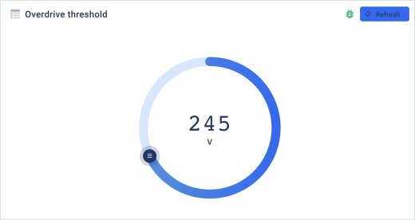

Now, we have the last thing to implement: we need to be able to **update the device threshold**.

In the `/src/device-configuration.ts` define the function that will be able to set the device configuration:

```js
  interface SetConfigurationParams {
    client: ECRClient;
    value: any;
    configuration: WidgetConfig;
    etag: string;
    deviceConfigurationValue: Record<string, any>;
  }

  export const setConfiguration = ({
    client,
    value,
    configuration,
    etag,
    deviceConfigurationValue
  }: SetConfigurationParams) => {
    const endpointId = _get(configuration, 'serviceIntegration.endpointId');
    const configurationDataPath = configuration.serviceIntegration && configuration.serviceIntegration.dataPath;
    const appVersionName = _get(configuration, 'serviceIntegration.applicationVersionName');
    const isDefaultAppConfiguration = _get(configuration, 'serviceIntegration.defaultConfig');

    const data = { ...getDeviceUpdatedConfig(deviceConfigurationValue, configurationDataPath, value) };

    if (isDefaultAppConfiguration) {
      return client
        .setDefaultConfiguration({
          appVersionName,
          headers: {
            'If-Match': etag,
          },
          data,
        })
    }

    return client
      .setEndpointConfiguration({
        appVersionName,
        endpointId,
        headers: {
          'If-Match': etag,
        },
        data,
      });
  }
```

Above we can see:
- **setDefaultConfiguration({...})** - the [ECR PUT default configuration abstraction](https://docs.kaaiot.io/KAA/docs/v1.3.0/Features/Configuration-management/ECR/REST-API/#app_versions__appversionname__put) 

- **setEndpointConfiguration({...})** - the [ECR PUT endpoint abstraction](https://docs.kaaiot.io/KAA/docs/v1.3.0/Features/Configuration-management/ECR/REST-API/#endpoints__endpointid__app_versions__appversionname__put) 

Let's add the update handler to out `/src/App.tsx`:

```js
  const handleChange = _debounce((value) => {
    setConfiguration({
      value,
      client: ecrClient.current,
      configuration,
      etag,
      deviceConfigurationValue
    })
      .then((response) => {
        setLoading(false);
        const deviceConfig = extractDeviceConfig(response.data['config']);
        setDeviceConfigurationValue(deviceConfig);
        setEtag(extractEtagHeader(response.headers));
      })
      .catch((error) => {
        console.error("Error while updating device configuration", error);
      });
  }, 500);
```

and pass it to the __CircularSlider__ `onChange` listener:

```js
  ...
    <CircularSlider
      width={250}
      label={configuration.postfix || 'Current value'}
      labelBottom
      labelColor={themeColors.textColors.colorPrimary}
      knobColor={themeColors.textColors.colorPrimary}
      trackColor={themeColors.elementColors.colorSurface2}
      progressColorFrom={themeColors.textColors.colorSecondary}
      progressSize={16}
      trackSize={16}
      dataIndex={value}
      onChange={handleChange} // The onChange handler is passed here.
    />
  ...
```

Check the Kaa UI and **Refresh** the widget in order to retrieve its latest functionality updates.

Now, update the widget value manually and have fun. :) 

When we are done and our widget is ready, in order to be able to use our widget on the solutions' dashboards without the **development mode**, we need to **upload** the latest bundle version and **activate** the widget:

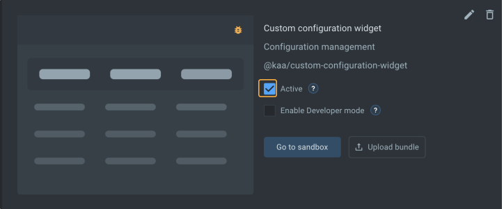

After our widget is ready, let's add it to the Building management system **Room** dashboard and calibrate the humidity value in this room:

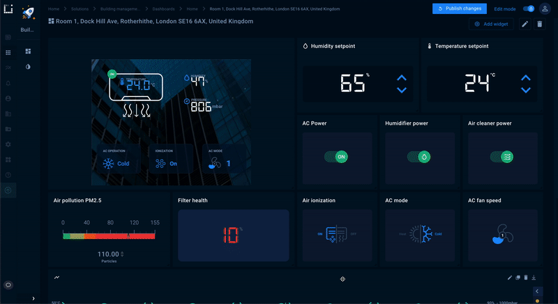

The full tutorial code can be found [here](https://github.com/kaaproject/kaa-custom-widget-tutorial).

## Widget configuration overview

Kaa widgets are supposed to be configurable, i.e. the same widget is supposed to work with different data source service instances, with different application and application versions, and to display and update the data for different endpoints (devices) of the same application / application version, etc.

For the reasons listed above, Kaa widgets support dynamic configuration by the means of consuming the JSON schema.

A simple JSON-schema widget configuration may look like this:

```js
  {
    type: 'object',
    properties: {
      serviceIntegration: {
        type: 'object',
        name: 'Data source',
        properties: {
          service: {
            type: 'string',
            name: 'Service instance name',
            enum: [],
          },
          applicationVersionName: {
            type: 'string',
            name: 'Application version name',
            enum: [],
            enumNames: [],
          },
        },
        required: ['service', 'applicationVersionName']
      }
    }
  }
```

More about the JSON schema may be read [in the JSON schema specification documentation](https://json-schema.org/).

In terms of the Kaa widgets, a JSON schema - as the core or skeleton of the widget configuration - is supplemented with the UI schema.

The UI schema is a plain javascript object that mirrors the JSON schema structure and defines the visual view of the corresponding JSON schema fields. For example, such schemas combination in the Multiseries chart:

```js
  { // JSON scchema
    ...
    series: {
      title: 'Series to display',
      type: 'object',
      properties: {
        displayType: {
          type: 'string',
          enum: ['all', 'specific'],
          enumNames: ['All available series', 'Specific series'],
          default: 'all',
        },
      }
    }
    ...
  }

  { // UI schema
    ...
    series: {
      displayType: {
        'ui:widget': 'RadioWidget',
        'ui:options': {
          label: false,
        },
      },
    }
    ...
  }
```

defines that by JSON path `(...).series.displayType` **radio buttons** should be displayed

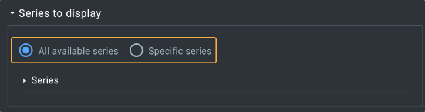

Also, via **ui:options** we can define some visualization modifications, such as show field label or not; for some UI fields we can add some styling and some other configurations.

However, one of the most prominent and useful features of the UI schema is the ability to prefill the available value listings into the fields, such as **service instance name**, **application name**, **application version name**, available **time series names** for the selected application version, etc.

Here is the fragment of the UI schema used in the current tutorial:

```js
  {
    dataPath: {
      'ui:widget': 'select',
      'ui:options': {
        creatable: true,
        transformation: {
          dataset: {
            dataPath: {
              name: 'dataPath',
              sourceName: 'config_keys',
              observes: [
                {
                  name: 'appVersionName',
                  valueFrom: '$.serviceIntegration.applicationVersionName',
                },
                {
                  name: 'defaultConfig',
                  valueFrom: '$.serviceIntegration.defaultConfig',
                },
                {
                  name: 'endpointId',
                  valueFrom: '$.serviceIntegration.endpointId',
                },
              ],
            },
          },
          select: {
            dataPath: {
              type: 'JSONPath',
              value: '$.dataPath.keys',
            },
          },
          updates: [
            {
              attribute: 'enum',
              value: '${dataPath}',
            },
          ],
        },
      },
    }
  }
```

This schema contains directives for the Kaa UI to prefill the configuration data path options into the **Configuration field to display** select.

The schema defines the data path keys dependency on the already selected **application version name** and **default configuration** checkbox value, as well as the selected **endpoint ID**.

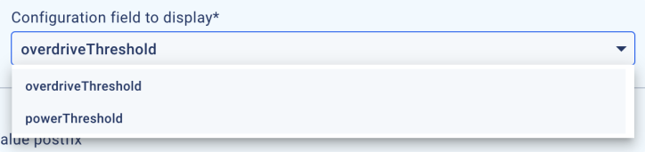

