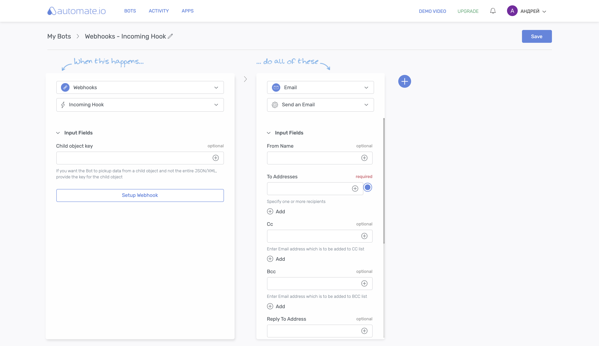
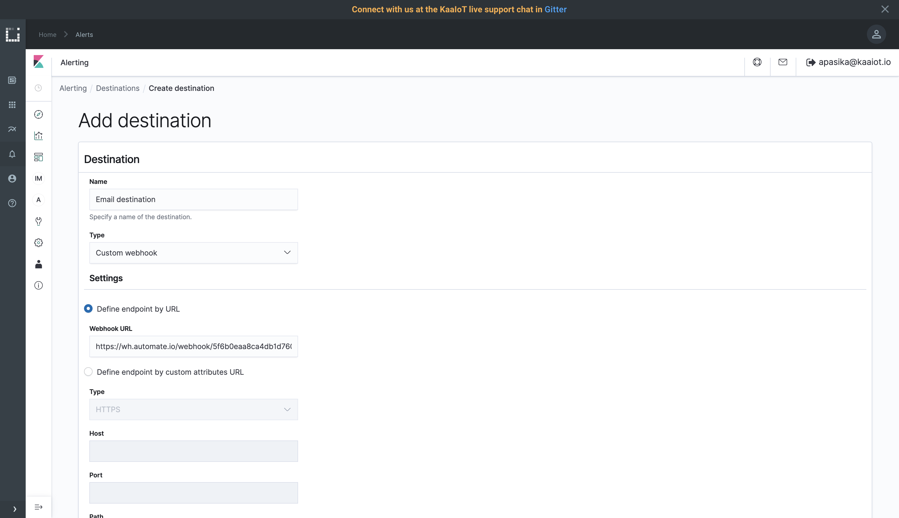
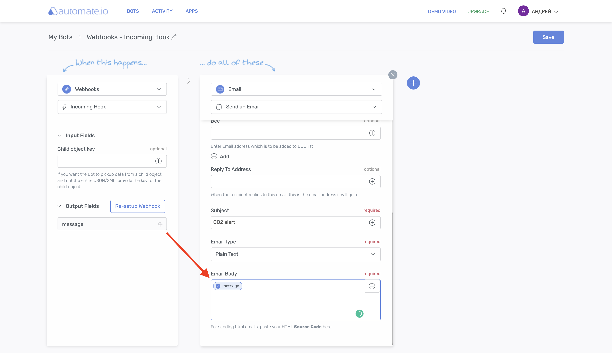
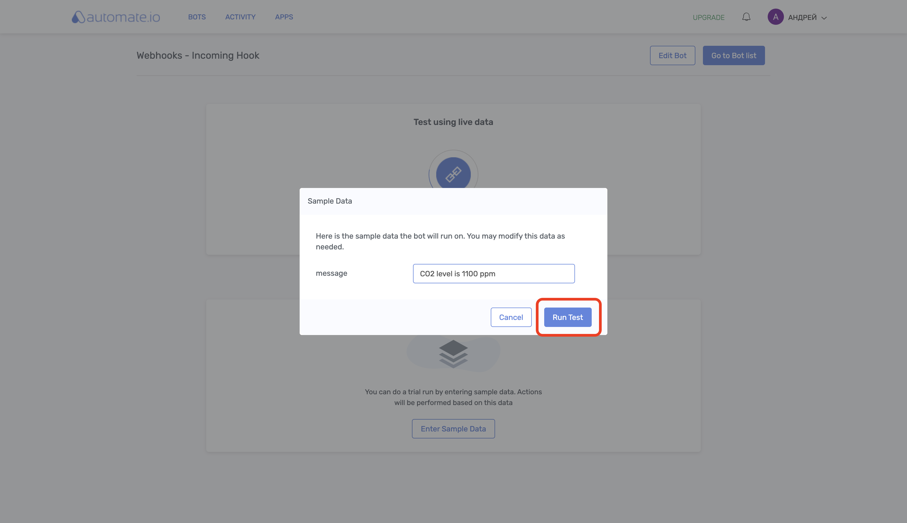
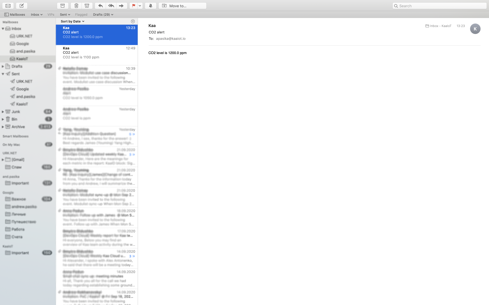




* TOC
{:toc}

Based on the [*Kaa v1.2*][whats new in 1.2].

Time to complete: *17 min*.


## Overview

Welcome to the fifth tutorial in the Kaa getting started guide!
We assume that you have successfully [connected your first device][connecting your first device] to Kaa, [collected data from a device][collecting data from a device], and [sent alerts with Open Distro][open distro alerting tutorial] so make sure to review those tutorials before proceeding here.

From this tutorial, you will learn how to configure an webhook destination for Open Distro that will be triggered to send an email when a certain telemetry value from the endpoint exceeds a defined threshold.

We will use [automate.io](https://automate.io) for email sending.


## Open Distro integration

We assume that you have successfully completed [Open Distro Alerting][open distro alerting tutorial] tutorial and remember the theory but let's recap what is Open Distro.
Open Distro is open-source distribution of Elasticsearch with advanced security, alerting, SQL support, automated index management, deep performance analysis, and [more][open distro documentation].
Kaa forwards all telemetry data from your endpoints into [Elasticsearch index](https://www.elastic.co/blog/what-is-an-elasticsearch-index) attached to your tenant.


## Playbook


### Create bot on automate.io

Register an account on [automate.io](https://automate.io) then go to **Bots** and click **Create a Bot** button.
Search and select **Webhooks** for the Trigger app and **Incoming Hook** for the trigger event.
Search and select **Email** for the Action app and **Send an Email** for the Action to be done.



Click **Setup Webhook** on the left and and you will be redirected to the **Setup Webhook** page with the webhook URL.
Leave this page opened, we will return to it in a moment.


### Create webhook destination

We assume that you have already created CO2 monitor and trigger during completing the previous [Open Distro Alerting][open distro alerting tutorial] tutorial so that your monitor looks next:

```sql
WHEN max()
OF dataSample.co2
OVER all documents
FOR THE LAST 1 minute(s)
WHERE dataSample.co2 is greater than 1000
```

and trigger is `IS ABOVE 1,000`.

If you don't have the above monitor and trigger, go to the [Open Distro Alerting][open distro alerting tutorial] and create them.
It won't take much time.
Meantime, we will wait you here ;)

<br/>

To create a webhook destination, go to the **Alerting**, **Destination** and click **Add destination** button.


Enter "Email destination" into the **Name** field.
Select **Custom webhook** for the **Type** field.
Go the the earlier opened page with the URL on the [automate.io](https://automate.io), copy the URL and paste it into the **Webhook URL** field.



Click **Create**.

Go to **Monitors**, click on your monitor (it was named **CO2 level monitor** in the previous tutorial), find **CO2 level trigger**, select it and click **Edit**.
Scroll to the bottom and click and click **Add action**.

Enter "Email action" for the **Action name** field.
<!--== We use such trick since Jekyll treats pair of curly braces as variable ==-->

Select just created **Email destination** for the destination field and paste the next text for the **Message** field: `{"message": "CO2 level is {{co2var}} ppm"}`.

Now complete bot setup on [automate.io](https://automate.io).
For that, click **Send test message**


return back to the page with webhook URL on the [automate.io](https://automate.io) and click **I'm Done**.
Just sent test message must appear.


Click **Looks Good** and the current page will close.
Return to the action configuration page on Kibana and save changes.

Go the bot setup page and fill in **From Name**, **To Addresses**, **Subject** and drag and drop **message** output field into the **Email Body** 



Save your changes, enable the bot, click **Enter Sample Data** and click **Run Test** button.



The mail must arrive to the specified **To Address** email.


### Report high CO2 level

Let's report that CO2 equals 1200 and see what happens.

Simulate a high CO2 level by invoking the next `cURL`.
Don't forget to replace `<app-version-name>` and `<endpoint-token>` with your application version name and the endpoint token respectively.

```bash
curl --location --request POST 'https://connect.cloud.kaaiot.com:443/kp1/<app-version-name>/dcx/<endpoint-token>/json' \
--data-raw '{
  "co2": 1200
}'
``` 

Within a minute you should receive an alerting mail.




### View alerts history

To view alerts history, go to the alerting dashboard.


## Learn more

- Check out the webinar where we explained Open Distro analytics and alerts in more details: [Data Analytics and Notifications][webinar Data Analytics and Notifications]
- Learn [Open Distro documentation][open distro documentation] and get deep insights into your IoT data


## Feedback

This tutorial is based on Kaa 1.2 released on July 6-th, 2020.
If you, our reader from the future, spot some major discrepancies with your current version of the Kaa platform, or if anything does not work for you, please [give us a shout][Kaa user chat] and we will help!

And if the tutorial served you well, we'd still love to hear your feedback, so [join the community][Kaa user chat]!

<br/>
<div style="display: flex; justify-content: space-between;">
<div>
<a class="free_trial__button" href="{{sending_commands_to_device}}"><< Sending commands to device</a>
</div>
<div>
<a class="free_trial__button" href="{{authenticating_client_with_tls_certificate}}">Authenticating client with TLS certificate >></a>
</div>
</div>


[open distro documentation]: https://opendistro.github.io/for-elasticsearch-docs/
[create monitor]: https://opendistro.github.io/for-elasticsearch-docs/docs/alerting/monitors/#create-monitors
[create trigger]: https://opendistro.github.io/for-elasticsearch-docs/docs/alerting/monitors/#create-triggers
[create destination]: https://opendistro.github.io/for-elasticsearch-docs/docs/alerting/monitors/#create-destinations
[create action]: https://opendistro.github.io/for-elasticsearch-docs/docs/alerting/monitors/#add-actions
[slack webhook]: https://api.slack.com/messaging/webhooks
