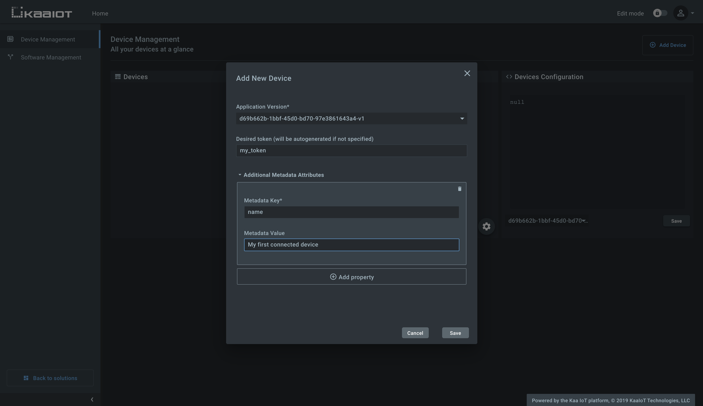
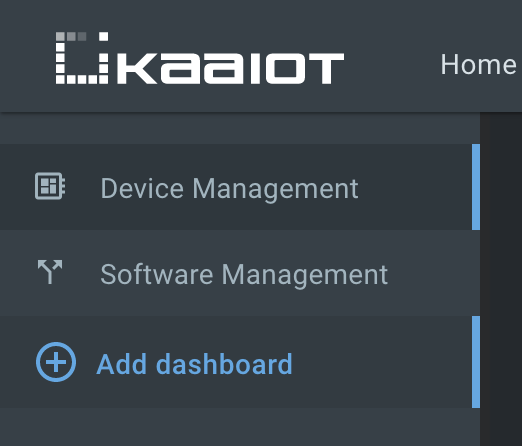
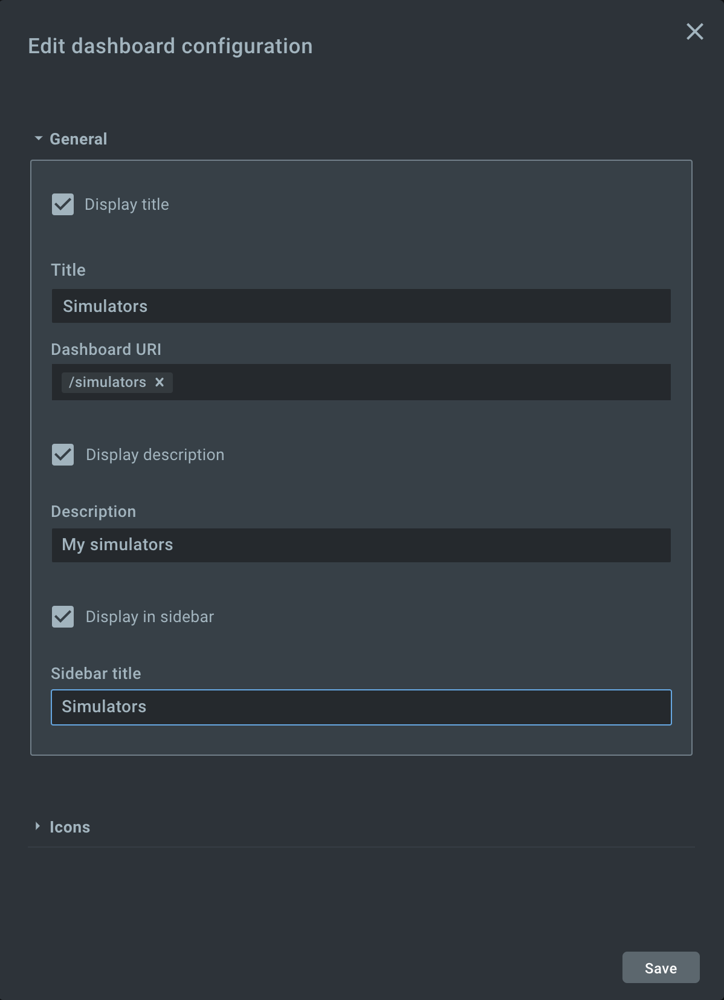
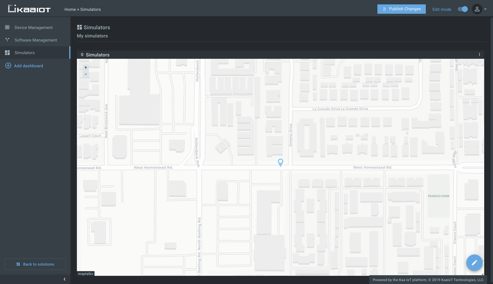
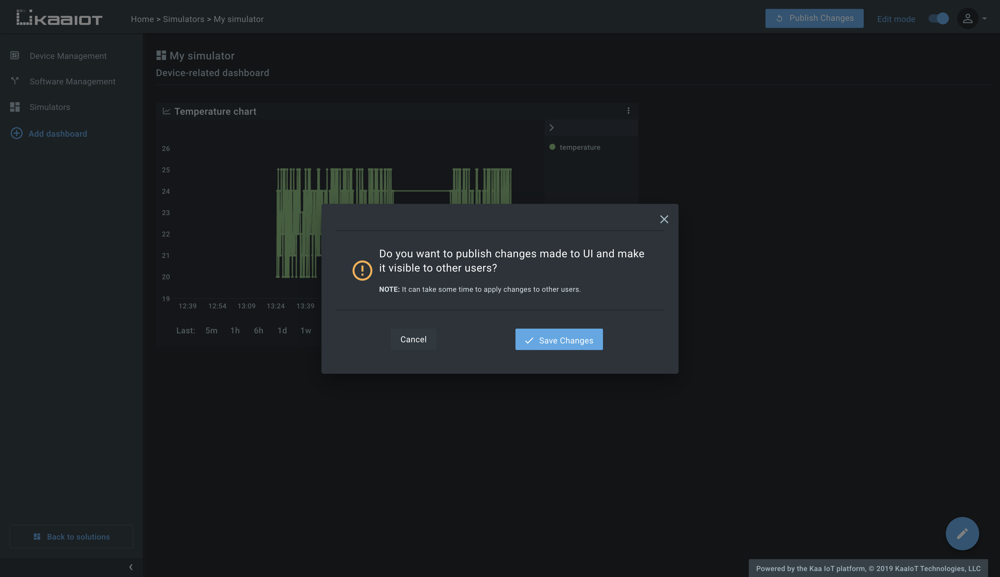




* TOC
{:toc}


## Overview

In this tutorial, we will look at how to get started with the [Kaa Cloud][Kaa cloud] in two simple steps:

1. Connect a [device simulator][client_url] to the Kaa Cloud server.
2. Send and visualize the device simulated data on the [Web Dashboard][WD].


## Prerequisites

1. You have an account on the [Kaa Cloud][Kaa cloud].
It is free and has no time limit, so create one if you haven't got it yet.


## Playbook


### Connect a device

To help you get started with the Kaa Cloud real quick, we've created a [Python simulator][client_url] that connects to the platform and simulates a real device behavior, as follows:

**1**. The simulator sends the following metadata to the platform on its start.

```json
{
    "serial": "00-14-22-01-23-45",
    "mac": "50:8c:b1:77:e8:e6"
}
```

**2**. The simulator sends telemetry data of the following format every 10 seconds.

```json
{
    "timestamp": 1569836796860,
    "temperature": 23,
    "log": "Randomly generated string: YjZgn3IbM6",
    "latitude": 37.34929,
    "longitude": -122.03247,
    "battery_level": 78.7
}
```

where:
- `timestamp` - the current timestamp;
- `temperature` - a random number in the range of 20-25;
- `log` - a string with a randomly generated last part;
- `latitude` - latitude taken from the [file][location_json];
- `longitude` - longitude taken from the [file][location_json];
- `battery_level` - a number in the range of 0-100.

**3**. The simulator listens to the `HEALTH_CHECK` [command][commands] and responds with the following telemetry data upon receiving it.

```json
{
    "log": "Endpoint health status: OK"
}
```

<br/>

By default, a Kaa Cloud account includes pre-provisioned [endpoint filters][endpoint-filter] and [software (firmware) definitions][ota] so you can play with it as well.

<br/>

Now let's proceed with the instructions to get you going.

**1**. Go to the "Device management" dashboard in your [Kaa Cloud account][Kaa cloud].


As you can see, there are no connected devices yet.
Let's connect one.

<br/>

**2**. Click "Add device" to start registering the device digital twin.
It's called "[endpoint][endpoint]" in Kaa.

**3**. Choose the [application version][application] from the drop-down menu. 
You can bump the application version in the application administration page as you go along and your devices evolve.
Enter the desired [endpoint token][endpoint-token].
The token is used for device identification during its communication with the Kaa platform. 
Endpoint tokens are any non-empty strings that do not contain the following reserved characters: `+`, `#`, `/`, and `.`. 
The token will be autogenerated if you leave this field blank.

Enter endpoint metadata and click `Save`.
Metadata is simply key-value attributes that provide certain information about a device, e.g. its location, owner, customer, model, etc.



<br/>

**4**. Copy and save the endpoint token in some file because **you won't be able to see it again in the future**.
We will use the token in a bit to connect the simulator.


<br/>

**5**. Go to the device details page of the recently created endpoint (by clicking on the corresponding row in the device table) and copy its [application version][application].


<br/>

**6**. Open the simulator using [this link][client_url], enter the `app_version_name` and the device `token`, which you have saved in the previous steps, and run the simulator.

After accomplishing the step, you should see the simulator logs.

```text
INFO: Using endpoint token {{token}}, server at cloud.kaaiot.com:1883
DEBUG: Composed data collection topic: kp1/{{application_version}}/dcx/{{token}}/json/59
DEBUG: Composed command log topic: kp1/{{application_version}}/cex/{{token}}/command/HEALTH_CHECK/status
DEBUG: Composed command result log topic: kp1/{{application_version}}/cex/{{token}}/result/HEALTH_CHECK
INFO: Connecting to KPC instance at cloud.kaaiot.com:1883...
INFO: Successfully connected
INFO: Sent metadata: {"serial": "00-14-22-01-23-45", "mac": "50:8c:b1:77:e8:e6", "latitude": 37.35119, "longitude": -122.03248}

DEBUG: {{token}}: Sent next data sample: [{"timestamp": 1573491828080, "temperature": 24, "log": "Randomly generated string: INSG0Y8OLP", "latitude": 37.35119, "longitude": -122.03248, "battery_level": 100}]
INFO: Message received: topic [kp1/{{application_version}}/dcx/{{token}}/json/59/status]
body []
```

Congratulations, you have just connected your first device simulator to the Kaa Cloud!
It is time to visualize some data.

<br/>


### Visualize data from the device

We are going to create two dashboards: a dashboard with a map widget displaying all devices and a dashboard with a chart widget displaying specific device data only.

**1**. Turn on the edit mode (the top right corner switch) and click the "Add dashboard" button, which will appear after turning on the edit mode.



**2**. Populate the dashboard creation form as shown on the screen below.



**3**. Now let's add the second dashboard, which displays data from the device.
Again, click "Add dashboard" and fill out the dashboard creation form.
One difference is that we don't want to display this dashboard in the sidebar, since every time we open the dashboard we must somehow pass a value for the `endpointId` dashboard URL parameter.
[Endpoint Location widget][ep-location-widget] will do it for us later.
The dashboard discovers the endpoint that it must display data for using the value of the `endpointId` URL parameter. 


**4**. Go back to the first dashboard, search for the [Endpoint Location widget][ep-location-widget] and add it to the dashboard.
Configure the widget to route a browser to the device dashboard by clicking on device pins.


**5**. Save changes and arrange the widget as you like.



<br/>

It's time to visualize data from the device.

**6**. To build a chart from the temperature, add and configure the [Multi Series Chart widget][multi-series-chart-widget].


**7**. Click the "Publish changes" in the top right corner to save changes so that they won't be dismissed after the page refresh.



<br/>

Congratulations, you have connected and visualized data from your device!
Now play around with other simulator readings `battery_level`, `latitude`, `longitude` and add your own.
We encourage you to experiment with the simulator source code, modify the dashboards, and get back to us with the feedback!

<br/>

Explore the "Software management" dashboard and get acquainted with its capabilities.

## Next steps

- [Communication][communication] - find out what is under the hood of the Kaa platform communication layer.
- [Device management][identity] - learn how the Kaa platform device management feature works.
- [Data collection][data collection] - learn how the Kaa platform data collection feature works.


[ep-list-widget]: {{wd_url}}Widgets/#ep-list
[ep-location-widget]: {{wd_url}}Widgets/#ep-location
[multi-series-chart-widget]: {{wd_url}}Widgets/#multiseries-chart
[location_json]: https://github.com/kaaproject/kaa/tree/master/doc/Tutorials/getting-started-kaa-cloud/attach/code/location.json
[client_url]: https://repl.it/@KaaIoT/SimulateEndpointTelemetryData
