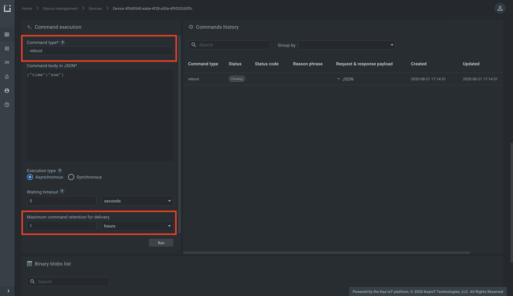
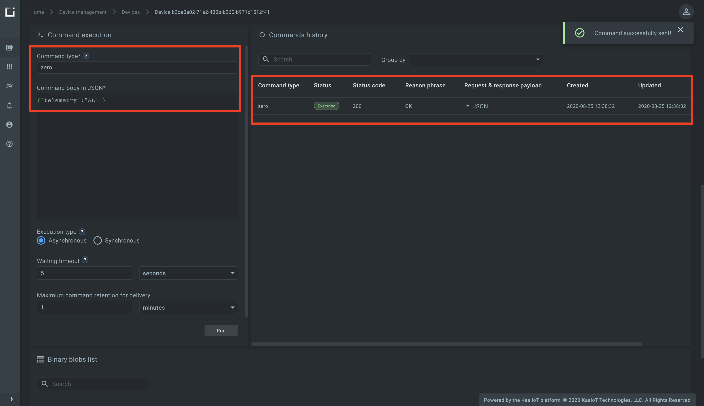
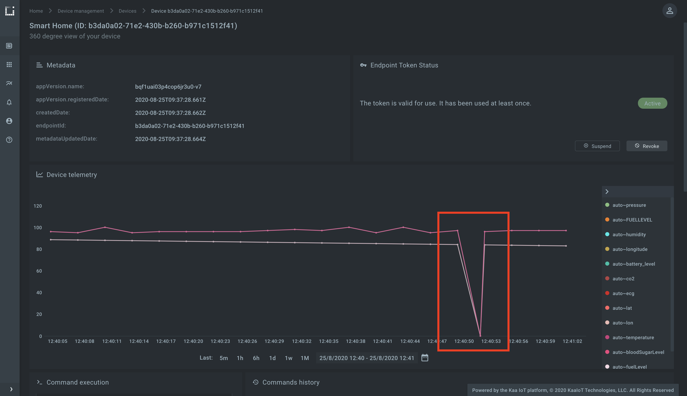
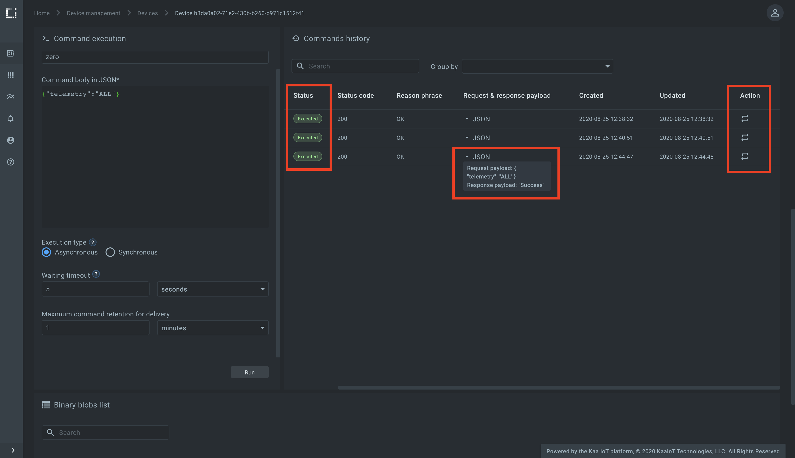




* TOC
{:toc}

Based on the [*Kaa v1.2*][whats new in 1.2].

Time to complete: *8 min*.


<!-- TODO: add video link

<div align="center">
  <iframe width="640" height="385" src="https://www.youtube.com/" frameborder="0"
          allow="accelerometer; autoplay; encrypted-media; gyroscope; picture-in-picture" allowfullscreen></iframe>
</div> --->


## Overview

Welcome to the third tutorial in the Kaa getting started guide!
We assume that you have successfully collected data from your device to Kaa, so make sure to [review the second tutorial][collecting data from a device] before proceeding here.

From this tutorial you will learn some additional concepts of the Kaa platform and discover how to:

* execute commands on your device
* view command execution history on the Kaa UI


## Terms and concepts

Let us start by reviewing some new terms and concepts related to the Kaa command invocation feature.


### Command

**Command** is a short-lived message sent to a connected endpoint from the Kaa platform.
With the commands, you can toggle the lights on/off, open a car trunk, or request an immediate endpoint state report.

Any commands may be in either *pending* or *executed* state.
*Pending* state means that the command was invoked but no execution result for that command is known yet.
*Executed* state is assigned to the command that has gotten an endpoint response, meaning an endpoint received the command, executed it, and sent the execution result back to the platform.

Consider the following example.

Let's assume you just sent a command to your Tesla car to park itself in a parking slot.
The platform immediately assigns *pending* to that command, while your Tesla receives the command and starts parking.
After finishing with the task, the car reports the execution result of that command back to the platform and Kaa assigns *executed* to that command.

Every command has an execution _status code_ and _reason phrase_ that endpoints can specify at the moment of reporting the execution result back to the platform.
If, for example, your Tesla couldn't finish the parking because it was taken by another vehicle, it may report the execution result specifying `409` status code and some meaningful reason phrase, which will be displayed for you in the Kaa UI. 


### Command type

**Command type** represents the type of command that you want to execute on an endpoint e.g. `reboot`, `close-door`, `switch-light`, or in the case of Tesla---`park`.
An endpoint can handle as many command types as you define in its firmware.

Now, let's jump into action and do some practice.


## Playbook

We assume that you have already created an application, application version, and endpoint with a token while following the ["connecting your first device" tutorial][connecting your first device].
You can reuse them or create new ones.

Start by logging into your [Kaa Cloud account][Kaa cloud].


### Invoke a command

<ul class="nav nav-tabs">
  <li class="active"><a data-toggle="tab" href="#http-client">HTTP</a></li>
  <li><a data-toggle="tab" href="#mqtt-client">MQTT</a></li>
</ul>

<div class="tab-content"><div id="http-client" class="tab-pane fade in active" markdown="1">

<br>

When the user invokes a command (e.g., from Kaa UI) on a device that connects to the platform over a synchronous protocol (e.g., HTTP), there is no way for the platform to push such command to the device.
Instead, Kaa persists the command and waits until the device requests it for execution.
This means that for devices with synchronous protocols it is their responsibility to periodically poll the platform for new commands.

So let's invoke some command and make it available for execution by an endpoint.  

Go to the endpoint's dashboard and find the "Command execution" widget.

Fill out _Command type_ field with `reboot` and set _Maximum command retention for delivery_ to 1 hour.
_Maximum command retention for delivery_ defines the time of how long the command is available for execution by an endpoint.

Click `Run`.



Once the command is invoked, it appears in a response to the polling during the time specified in the _Maximum command retention for delivery_ field (1 hour in our case).

To poll the platform for new commands with the `reboot` command type, execute the bellow `cURL`.
The last part of the URL designates the command type, which in our case is `reboot`.

Replace `<app-version-name>` with the actual application version used by the endpoint and `<endpoint-token>` with the endpoint token.

```bash
curl --location --request POST 'https://connect.cloud.kaaiot.com:443/kp1/<app-version-name>/cex/<endpoint-token>/command/reboot' \
--data-raw '{}'
```

You just retrieved the earlier invoked command.
Capture the `id` from the response.
It's an internal **command ID** used by Kaa to uniquely identify the command.

Note that the command is still in the `Pending` state in the "Commands history" widget on Kaa UI.
Let's send the command execution result back to Kaa.

Specify the application version for `<app-version-name>`, the endpoint token for `<endpoint-token>` and the command ID for `<command-ID>` from the earlier received response body.

```bash
curl --location --request POST 'https://connect.cloud.kaaiot.com:443/kp1/<app-version-name>/cex/<endpoint-token>/result/reboot' \
--data-raw '[{
    "id": <command-ID>,
    "statusCode": 200,
    "reasonPhrase": "OK",
    "payload": "Success"
}]'
```

When the platform receives the execution result for the command with the specific **command ID**, it marks the command as **executed** and stops returning it in a response for the command polling.  

<br>

</div><div id="mqtt-client" class="tab-pane fade" markdown="1">

<br>

To run the below MQTT client on your PC, you will need [Python 3][python download] installed.
To speed things up a little, you can also just [open and run it on Repl.it][sending commands to the device repl].

Initialize the `ENDPOINT_TOKEN` and the `APPLICATION_VERSION` variables with endpoint token and application version respectively.

```python

```

Run the python code.

Now that the simulator is running, go to the endpoint's dashboard and send a command with type `zero` to the endpoint.



Navigate to the endpoint `Device telemetry` widget and see that the endpoint responded with zero telemetry data values.



<br>

</div></div>

Now repeat the above procedure with any other command specifying custom _Command type_ and _Command body in JSON_.


### Browsing command history

You can browse command history using the `Commands history` widget on Kaa UI.
You can view command status ("Pending" or "Executed"), its request and response payloads, and re-run the command.




## Resources

All the tutorial resources are located on [GitHub][code url].


## Feedback

This tutorial is based on Kaa 1.2 released on July 6-th, 2020.
If you, our reader from the future, spot some major discrepancies with your current version of the Kaa platform, or if anything does not work for you, please [give us a shout][Kaa user chat] and we will help!

And if the tutorial served you well, we'd still love to hear your feedback, so [join the community][Kaa user chat]!

<br/>
<div style="display: flex; justify-content: space-between;">
<div>
<a class="free_trial__button" href="{{collecting_data_from_a_device}}"><< Collecting data from a device</a>
</div>
<div>
<a class="free_trial__button" href="{{open_distro_alerting}}">Open Distro alerting >></a>
</div>
</div>

[code url]: https://github.com/kaaproject/kaa/tree/rel_1.2.0/doc/Tutorials/getting-started/sending-commands-to-your-device/attach/code
