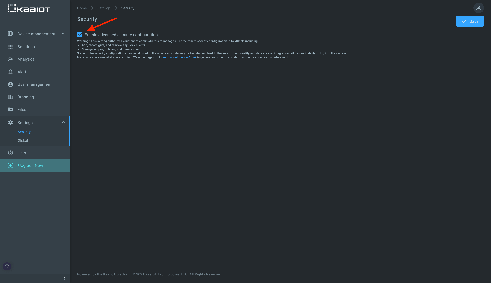
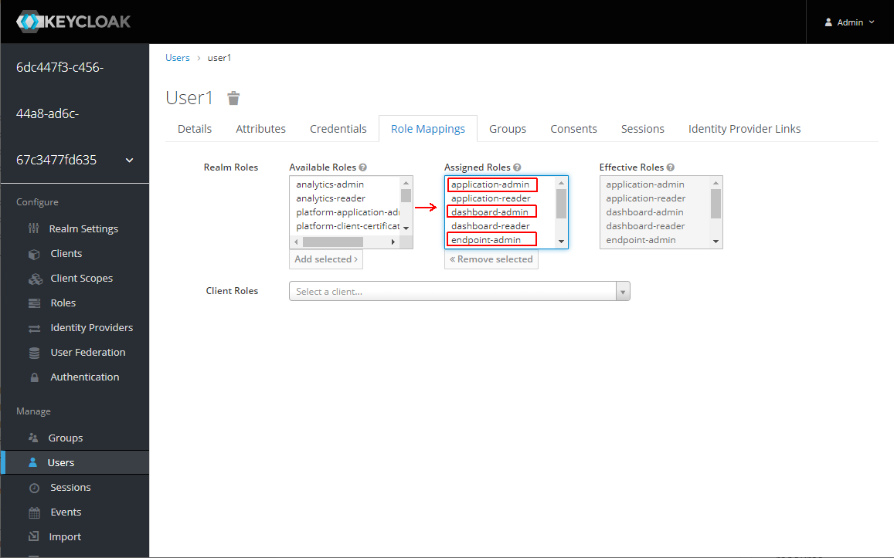
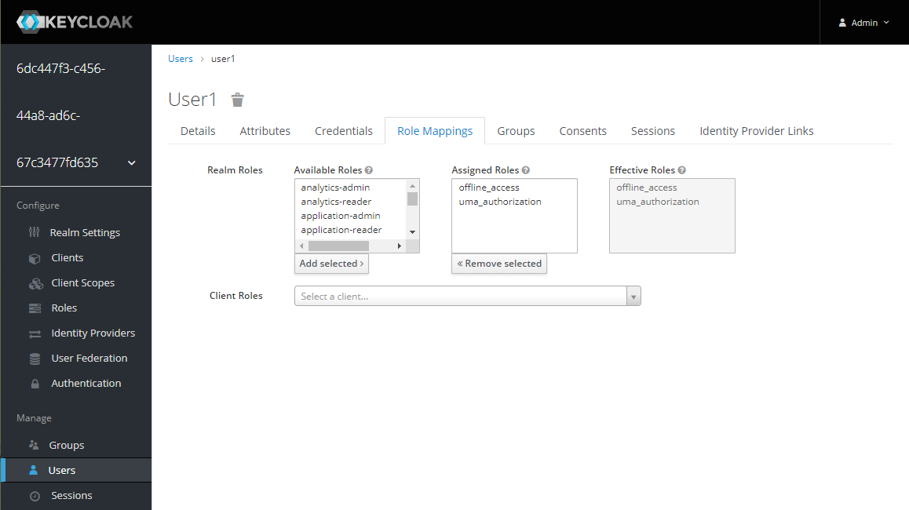




* TOC
{:toc}

Based on the [*Kaa v1.2*][whats new in 1.2].

Time to complete: *12 min*.

## Overview

Welcome to the seventh tutorial in the Kaa getting started guide!

From this tutorial, you will learn how to add a new user, assign permissions to it, and restrict user access to one or more resources of the _application_ or _endpoint_ types.

We will work with the [Keycloak](https://www.keycloak.org/) - open-source identity and access management solution used by the Kaa platform.

In the first part, we will discover how to grant the user read-only and read-write access on all applications, dashboards, and endpoints.  
In the second part, we will grant the user read-only access to one application and one endpoint in the given application.

## Prerequisites

To complete this tutorial you need to enable **Advance security configuration** in the Security menu in the Settings tab.
This setting authorizes your tenant administrators to manage all of the tenant security configurations in Keycloak, including:

* add, reconfigure, and remove Keycloak clients
* manage scopes, policies, and permissions

Some of the security configuration changes allowed in the advanced mode may be harmful and lead to the loss of functionality and data access, integration failures, or inability to log into the system.

So be careful since with great power comes great responsibility!

## Playbook

### User with no permissions

Log in under the user with root privileges and create a new user with no permissions assigned.
Specify its username and password.

  

Log in under a newly created user and check that it has no permissions to view, modify, and create any resources - applications, endpoints, dashboards, etc.

  

### Read-only access to all resources

Now we want to allow read-only access to all applications, dashboards, and endpoints.  
Get back to Keycloak, go to **Role Mappings** of the _user1_ user, and assign `application-reader`, `dashboard-reader`, and `endpoint-reader` roles.
  
Check that the user is able only to read all applications, dashboards, endpoints, but can't modify them - e.g., create/edit endpoints, create/edit dashboards, create/edit applications.

  

### Read-write access to all resources

Now we want the user to be able to create and edit applications, dashboard, and endpoint resources. 
For that assign `application-admin`, `dashboard-admin`, and `endpoint-admin` roles to the user.

Check that now user can edit dashboards, add applications, change application configuration, send commands, add/delete endpoints, etc.

  

### Grant user with access to specific resources

#### Application resource

We are going to grant the user access to one application and one endpoint inside the application.

For that we should do some preparation - unassign earlier assigned roles from the user and change authorization decision strategy to `Affirmative`.  

Select the user, go to the **Role Mappings**, and delete all roles except the default ones - `offline_access`, `uma_authorization`.

To change authorization settings, go to the **Clients** tab and find `kaa-rest-api` client among ones with UUID in the **Client ID** column.  
Then go to the **Authorization** -> **Settings** and change **Decision Strategy** to `Affirmative`.

  

Now everything is set-up to create a user-based policy.

Go to **Authorization** -> **Policies** and create policy for the user.

  

The policy is a condition(s) that must be satisfied to grant access to an object.
Unlike permissions, you do not specify the object being protected but rather the _conditions_ that must be satisfied for access to a given object.
With policies, you can implement strategies for attribute-based access control (ABAC), role-based access control (RBAC), context-based access control, or any combination of these.

We just created a policy with the condition that evaluates to true, i.e., grants access only for one user - _user1_.
By itself, a policy doesn't have any value until it is used with some permission.

To create permission with the above policy, go to **Authorization** -> **Permissions** and create scope-based permission.

Select the application resource you want to share, previously created user policy and enter `application:read`, `application:endpoint-filter:read`, `application:endpoints-metadata-keys:read`, `application:timeseries-config:read` scopes. 
Change the **Decision Strategy** to `Affirmative`.

  

The above permission associates the application resource and its scopes (`application:read`, `application:endpoint-filter:read`, etc.) with the policy for _user1_.

All right, we just granted _user1_ to perform operations protected by `application:read`, `application:endpoint-filter:read`, `application:endpoints-metadata-keys:read`, `application:timeseries-config:read` scopes on one application.
Let's look at these scopes and what they mean.

* `application:read` - read access to [application][application], its associated metadata, and service instance configurations.
* `application:endpoint-filter:read` - read access to [endpoint filters][endpoint-filter] created in a given application.
* `application:endpoints-metadata-keys:read` - read access to all existing [endpoint metadata][endpoint-metadata] attribute keys in a given application.
* `application:timeseries-config:read` - read access to all existing endpoint [time-series configurations][EPTS time series configuration] in a given application.

All platform scopes are documented [here][api security].

#### Endpoint resource

Let's grant the user read-only access to one endpoint in the above application.

Create one more scope-based permission for the endpoint resource with the same user policy and `endpoint:read` scope. 
**Decision Strategy** is `Affirmative`.

  

We just granted _user1_ to perform operations protected by `endpoint:read` scope on one endpoint.

* `endpoint:read` - read access to endpoint and its associated data: [tokens][endpoint-token], [metadata attributes][endpoint-metadata], [configuration][configuration], time-series, etc.

When designing your policies, you can simulate authorization requests to test how your policies are being evaluated.
There you can specify different inputs to simulate real authorization requests and test the effect of your policies.

Let's use the tool to check what scopes are granted to the user.

Go to **Authorization** -> **Evaluate** and run evaluation selecting the user and application, endpoint resources being protected.
The result must be PERMIT for both.

  

Go to UI and check that the user has read-only access to the granted application and endpoint.

  

## Resources

Read more about other scopes [here][api security].

## Feedback

This tutorial is based on Kaa 1.2 released on July 6-th, 2020.
If you, our reader from the future, spot some major discrepancies with your current version of the Kaa platform, or if anything does not work for you, please [give us a shout][Kaa user chat] and we will help!

And if the tutorial served you well, we'd still love to hear your feedback, so [join the community][Kaa user chat]!

 

<a class="free_trial__button" href="{{authenticating_client_with_tls_certificate}}"><< Authenticating client with SSL/TLS certificate</a>

<a class="free_trial__button" href="{{custom_web_dashboard}}">Build custom web dashboard on top of Kaa >></a>

