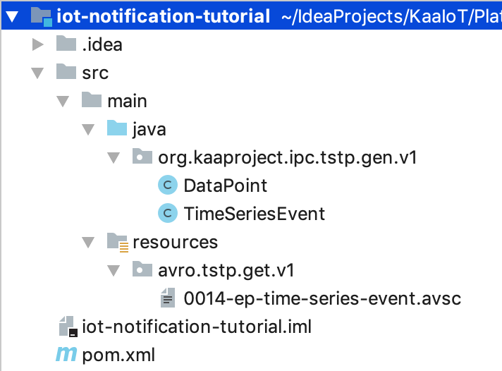




* TOC
{:toc}

## Overview

In this tutorial, you will learn **how to send email notifications on events from your device** (or [endpoint][endpoint] in Kaa terminology).
In fact, you can use a similar approach to implement any other automation instead of sending email notifications.
So the reaction to the received event can be different, for example, launching automation on another endpoint: changing the camera tilt, turning on a house alarm, etc.

We will teach you how to:
- **subscribe to [time series](https://en.wikipedia.org/wiki/Time_series) events** from [Endpoint Time Series service][EPTS];
- **decode time series events** into programming data structures;
- work with **time series data** from endpoints;
- **implement email notification service** shown in the diagram bellow.


## Prerequisites

1. You understand the [Kaa platform architecture][architecture overview].
2. You know how to [connect a device to the Kaa platform][how to connect device].
3. Your [Google account settings](https://myaccount.google.com/lesssecureapps) allow using less secure app access, so that SMTP client will be able to connect to Google SMTP server and send emails.
> Disable less secure app access after finishing the tutorial.
{:.important}
4. You have basic knowledge of the Java programming language.
5. You have configured Kubernetes [`kubectl`](https://kubernetes.io/docs/tasks/tools/install-kubectl/) utility to work with the Kubernetes cluster where Kaa platform is deployed.
<!-- todo: add link -->
6. You have an endpoint (or a simulator) that sends telemetry data with notifications into the platform.
If you don't, use [one from the tutorial](https://github.com/kaaproject/kaa/blob/master/doc/Tutorials/iot-notification/attach/code/sensor-simulator/client.py).
It randomly sends `{"event_type":"DOOR_OPENED"}` or `{"event_type":"WINDOW_OPENED"}` JSON into the platform every 30 seconds.


## Playbook

[Endpoint Time Series service][EPTS] is the guy from the Kaa microservices party that works with the endpoints' data samples :)
To put it simply, **EPTS transforms data samples into well-structured time series, saves them into database and fires events** with that time series data.
Any interested service can listen to these events and do some automation, like sending an email notification in our case.
You can find more information about EPTS [here][EPTS].

Let's jump to the implementation!

First things first, we need to configure EPTS with the corresponding notification time series.
It will accumulate data from your endpoint.
In the tutorial, the **time series** we want is called `notification`.
It has one **value** called `event_type`.
You may choose a different time series name and set of values in your own implementation.
To configure this time series, go to the platform administration page -> "Applications" -> {your application} -> EPTS configuration page.


<br/>

Now we are ready to write code that sends email notifications on receiving a time series event.

With the above configuration, EPTS will fire a `notification` time series event upon receipt of an endpoint data sample with the `event_type` field.
Here is an example of a **data sample** that should be sent by endpoint:

```json
{
  "timestamp": 1568380376544,
  "event_type": "DOOR_OPENED"
}
```

<br/>

For the **cross-service communication**, all Kaa microservices mainly communicate using **REST API and [NATS][nats]** messaging system.
NATS is mainly used in **event style messaging**.
All such messages are **[Avro][avro] encoded**.
REST API, in turn, is used in **request/response** style messaging.

<br/>

As you may have already guessed, **time series events are sent via NATS**.
Thus, to be able to receive and parse these events, we need a **NATS client** and an **Avro decoder**.

For that, create a Maven (or Gradle) project, and add **dependencies**:

- [`jnats`](https://mvnrepository.com/artifact/io.nats/jnats/2.6.5) - Java NATS client.
- [`avro`](https://mvnrepository.com/artifact/org.apache.avro/avro/1.9.1) - Java Avro dependency for encoding/decoding Avro messages.

Also, we need [`avro-maven-plugin`](https://mvnrepository.com/artifact/org.apache.avro/avro-maven-plugin/1.9.1) to **generate Java classes from Avro schemas**.

<!-- TODO: link to pom -->
Take a look at how dependencies and `avro-maven-plugin` must be arranged and configured in the project [pom.xml](https://github.com/kaaproject/kaa/blob/master/doc/Tutorials/iot-notification/attach/code/iot-notification-tutorial/pom.xml).

<br/>

Endpoint time series events are fired over the [Time Series Transmission Protocol (14/TSTP)][14/TSTP].
This protocol defines the **NATS subject and Avro schema** the time series messages are encoded with.

First, we need an Avro schema for our event.
Copy and paste [time series event schema]({{rfc_url}}0014/0014-ep-time-series-event.avsc) to the project `resources` folder, then run Maven's `generate-sources` goal:

```bash
$ mvn generate-sources
```

Following the goal execution, `org.kaaproject.ipc.tstp.gen.v1` package with two classes: `DataPoint` and `TimeSeriesEvent` must appear in the project's `java` folder.



Now, let's implement the `AvroConverter` Java class that converts incoming time series events to the previously generated `DataPoint` and `TimeSeriesEvent` classes.

```java
import org.apache.avro.io.BinaryDecoder;
import org.apache.avro.io.DatumReader;
import org.apache.avro.io.Decoder;
import org.apache.avro.io.DecoderFactory;
import org.apache.avro.specific.SpecificDatumReader;
import java.io.ByteArrayInputStream;

public class AvroConverter<T> {
  private final ThreadLocal<BinaryDecoder> threadLocalDecoder = new ThreadLocal<>();
  private final DatumReader<T> datumReader;

  /**
   * Creates converter instance for specified class type.
   * @param type - object type for which this converter will be initialized
   */
  public AvroConverter(Class<T> type) {
    this.datumReader = new SpecificDatumReader<>(type);
  }

  /**
  * Converts byte array into Java class passed in constructor.
  * @return Java class
  */
  public T decode(byte[] bytes) {
    ByteArrayInputStream byteIn = new ByteArrayInputStream(bytes);
    Decoder decoder = getDecoder(byteIn);
    try {
      return datumReader.read(null, decoder);
    } catch (Exception ex) {
      String msg = "Failed to deserialize submitted byte array into object.";
      throw new RuntimeException(msg, ex);
    }
  }

  private BinaryDecoder getDecoder(ByteArrayInputStream byteIn) {
    BinaryDecoder reuse = threadLocalDecoder.get();
    BinaryDecoder decoder = DecoderFactory.get().directBinaryDecoder(byteIn, reuse);
    if (reuse == null) {
      threadLocalDecoder.set(decoder);
    }
    return decoder;
  }
}
```

The `AvroConverter#decode` method accepts a byte array as an argument and produces an instance of the Java class type specified in the constructor.
Since `AvroConverter` is generic, it can decode messages other than `TimeSeriesEvent` and `DataPoint`.

<br/>

So far, so good.
Let's now implement `TimeSeriesEventService` service class that **subscribes to the `notification` time series** events from EPTS via NATS and **logs received events** into the console.

```java
import io.nats.client.Connection;
import io.nats.client.Dispatcher;
import io.nats.client.Message;
import io.nats.client.Nats;
import org.kaaproject.ipc.tstp.gen.v1.TimeSeriesEvent;
import java.util.function.Consumer;

public class TimeSeriesEventService {

  // Inbound message <a href="https://en.wikipedia.org/wiki/Apache_Avro">Avro</a> converter.
  private static final AvroConverter<TimeSeriesEvent> AVRO_CONVERTER = new AvroConverter<>(TimeSeriesEvent.class);

  private static final String NATS_URL = "nats://localhost:4222";

  // Time series and <a href="https://docs.kaaiot.io/EPTS/docs/current/Overview/">EPTS</a> information.
  private static final String TIME_SERIES_NAME = "notification";
  private static final String EPTS_SERVICE_INSTANCE_NAME = "epts";
  private static final String TSTP_SUBSCRIBE_SUBJECT = String
      .format("kaa.v1.events.%s.endpoint.data-collection.data-points-received.%s", EPTS_SERVICE_INSTANCE_NAME, TIME_SERIES_NAME);

  private final Connection natsConnection;

  public TimeSeriesEventService() throws Exception {
    this.natsConnection = Nats.connect(NATS_URL);
  }

  public void onTimeSeriesEvent() {
    Dispatcher dispatcher = natsConnection.createDispatcher((msg) -> handleNatsMessage(msg));
    dispatcher.subscribe(TSTP_SUBSCRIBE_SUBJECT);
    System.out.println(String.format("Subscribed to the time series [%s] events", TIME_SERIES_NAME));
    while (true) {
      // loop forever
    }
  }

  private void handleNatsMessage(Message msg) {
    try {
      TimeSeriesEvent timeSeriesEvent = AVRO_CONVERTER.decode(msg.getData());
      System.out.println(String.format("Handling incoming time series event: %s", timeSeriesEvent));
    } catch (Exception ex) {
      System.err.println(String.format("Exception occurred during handling time series event: %s", ex));
    }
  }
}
```

We use `AvroConverter` instance to convert byte array into `TimeSeriesEvent` in the `TimeSeriesEventService#handleNatsMessage` method.
We specify **NATS server URL** in the `NATS_URL` constant (`nats://localhost:4222` in our case) and NATS **subscribe subject** in the `TSTP_SUBSCRIBE_SUBJECT` (taken from the [14/TSTP][14/TSTP] Kaa protocol mentioned earlier).

<br/>

By now we have built an application that can already be launched to verify that it works properly and logs incoming time series events.
Let's do this.

Create `NotificationService` class with `main` method:

```java
import org.kaaproject.ipc.tstp.gen.v1.TimeSeriesEvent;
import java.util.stream.Collectors;

public class NotificationService {

  public static void main(String[] args) throws Exception {
    System.out.println("Starting notification application...");
    TimeSeriesEventService timeSeriesEventService = new TimeSeriesEventService();
    timeSeriesEventService.onTimeSeriesEvent();
  }
}
```

**Forward NATS server port from the Kubernetes cluster to your working laptop** by running the below command (observe the expected output):

```bash
$ kubectl port-forward -n kaa kaa-global-nats-0 4222:4222

Forwarding from 127.0.0.1:4222 -> 4222
Forwarding from [::1]:4222 -> 4222
Handling connection for 4222
```

Now, traffic on port 4222 on the NATS instance in your Kubernetes cluster is forwarded to your local port 4222.

Start the application.
You should be able to see endpoint time series events logged to the console:

```
Starting notification application...
Subscribed to the time series [notification] events
Handling incoming time series event: {"correlationId": "blt342qqicrcv30ar9og", "timestamp": 1568289291302, "timeout": 10000, "appVersionName": "demo_application_v1", "endpointId": "73a3c935-6342-4d30-ba5d-d4dd9fc07a4e", "timeSeriesName": "notification", "dataPoints": [{"timestamp": 1568289291301, "values": {"event_type": "DOOR_OPENED"}}]}
Handling incoming time series event: {"correlationId": "blt34aaqicrcv30ar9p0", "timestamp": 1568289321330, "timeout": 10000, "appVersionName": "demo_application_v1", "endpointId": "73a3c935-6342-4d30-ba5d-d4dd9fc07a4e", "timeSeriesName": "notification", "dataPoints": [{"timestamp": 1568289321329, "values": {"event_type": "WINDOW_OPENED"}}]}
```

<br/>

Great!
The final thing left to do is implement an **email service that sends email notifications with the time series event data** instead of just logging it.

For that, add [`spring-boot-starter-mail`](https://mvnrepository.com/artifact/org.springframework.boot/spring-boot-starter-mail/2.1.8.RELEASE) dependency to your project [`pom.xml`]() and create `EmailService` Java class with the next code:

```java
import org.springframework.mail.SimpleMailMessage;
import org.springframework.mail.javamail.JavaMailSenderImpl;
import java.util.Properties;

public class EmailService {

  private final String USERNAME = "my_username@gmail.com";  // Email from the Gmail account from which emails will be sent.
  private final String PASSWORD = "my_secret_pass";         // Password from the Gmail account.

  private final JavaMailSenderImpl mailSender;

  public EmailService() {
    JavaMailSenderImpl mailSender = new JavaMailSenderImpl();
    mailSender.setHost("smtp.gmail.com");
    mailSender.setPort(587);
    mailSender.setUsername(USERNAME);
    mailSender.setPassword(PASSWORD);

    Properties props = mailSender.getJavaMailProperties();
    props.put("mail.transport.protocol", "smtp");
    props.put("mail.smtp.auth", "true");
    props.put("mail.smtp.starttls.enable", "true");
    props.put("mail.debug", "true");
    this.mailSender = mailSender;
  }

  public void sendNotification(String to, String subject, String text) {
    SimpleMailMessage message = new SimpleMailMessage();
    message.setTo(to);
    message.setSubject(subject);
    message.setText(text);
    this.mailSender.send(message);
  }
}
```

Initialize the `USERNAME` constant with the Gmail account email on behalf of which mails will be sent.
Initialize the `PASSWORD` constant with the password for that account.

<br/>

Now let's use the `EmailService` service for sending the email notifications.

Go to the `TimeSeriesEventService` class and update `onTimeSeriesEvent` and `handleNatsMessage` methods so that `TimeSeriesEventService#onTimeSeriesEvent` method accepts consumer of the `TimeSeriesEvent` event message.

```java
  public void onTimeSeriesEvent(Consumer<TimeSeriesEvent> onTimeSeriesEventCallback) {
    Dispatcher dispatcher = natsConnection.createDispatcher((msg) -> handleNatsMessage(msg, onTimeSeriesEventCallback));
    dispatcher.subscribe(TSTP_SUBSCRIBE_SUBJECT);
    System.out.println(String.format("Subscribed to the time series [%s] events", TIME_SERIES_NAME));
    while (true) {
      // loop forever
    }
  }

  private void handleNatsMessage(Message msg, Consumer<TimeSeriesEvent> onTimeSeriesEventCallback) {
    try {
      TimeSeriesEvent timeSeriesEvent = AVRO_CONVERTER.decode(msg.getData());
      System.out.println(String.format("Handling incoming time series event: %s", timeSeriesEvent));
      // Calling the event consumer
      onTimeSeriesEventCallback.accept(timeSeriesEvent);
    } catch (Exception ex) {
      System.err.println(String.format("Exception occurred during handling time series event: %s", ex));
    }
  }
```

Finally, implement the `TimeSeriesEvent` consumer in the `NotificationService`:

```java
  private static String RECIPIENT_EMAIL = "email@example.com"; // Specify recipient of email notifications.

  public static void main(String[] args) throws Exception {
    System.out.println("Starting notification application...");
    EmailService emailService = new EmailService();
    TimeSeriesEventService timeSeriesEventService = new TimeSeriesEventService();
    timeSeriesEventService.onTimeSeriesEvent(timeSeriesEvent -> handleTimeSeriesEvent(timeSeriesEvent, emailService));
  }

  private static void handleTimeSeriesEvent(TimeSeriesEvent event, EmailService emailService) {
    String eventType = event.getDataPoints().stream()
        .map(dataPoint -> dataPoint.getValues().get("temperature").toString())
        .collect(Collectors.joining(", "));
    String emailMessageText = String.format("Next events has occurred: %s", eventType);
    emailService.sendNotification(RECIPIENT_EMAIL, "Smart house notifications", emailMessageText);
  }
```

After launching the application and receiving the first time series event from EPTS, you should be able to see the following logs:

```text
Starting notification application...
Subscribed to the time series [notification] events
Handling incoming time series event: {"correlationId": "blt342qqicrcv30ar9og", "timestamp": 1568289291302, "timeout": 10000, "appVersionName": "demo_application_v1", "endpointId": "73a3c935-6342-4d30-ba5d-d4dd9fc07a4e", "timeSeriesName": "notification", "dataPoints": [{"timestamp": 1568289291301, "values": {"event_type": "DOOR_OPENED"}}]}
DEBUG: JavaMail version 1.6.2
DEBUG: successfully loaded resource: /META-INF/javamail.default.address.map
DEBUG: getProvider() returning javax.mail.Provider[TRANSPORT,smtp,com.sun.mail.smtp.SMTPTransport,Oracle]
DEBUG SMTP: useEhlo true, useAuth true
DEBUG SMTP: trying to connect to host "smtp.gmail.com", port 587, isSSL false
220 smtp.gmail.com ESMTP n12sm2824931lfh.86 - gsmtp
...
```

<br/>

As a result, a **notification email should arrive to the specified recipient email**.


<br/>

Now you can go further and expand the application with the [metadata][endpoint-metadata] of the endpoint that produces the event.
Endpoint metadata can be retrieved from the [Endpoint Register service][EPR] using its [REST API][EPR REST API].
It can be endpoint location ("living room"), floor ("2nd floor"), etc., so that the email recipient can understand which device produced a notification and properly react.


## Resources

All tutorial resources are located on [GitHub][code_url].


## Next steps

- Get acquainted with the [14/TSTP][14/TSTP] protocol.


[code_url]: https://github.com/kaaproject/kaa/tree/master/doc/Tutorials/iot-notification/attach/code
