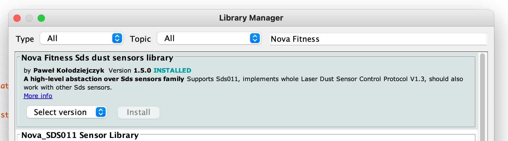




* TOC
{:toc}

Based on the [*Kaa v1.3*][whats new in 1.3].

Time to complete: *35 min*.


<!-- TODO: add video link

<div align="center">
  <iframe width="640" height="385" src="https://www.youtube.com/" frameborder="0"
          allow="accelerometer; autoplay; encrypted-media; gyroscope; picture-in-picture" allowfullscreen></iframe>
</div> --->


## Overview

Welcome to the Air Quality solution tutorial!
We assume that you have basic knowledge about the Kaa platform.
If any of the tutorial parts seems difficult to you, you can always refer to the [Getting Started tutorial cycle][getting started tutorials] where you will grasp the basic platform concepts.

At the end of the tutorial, you'll have the fully operable air quality monitoring solution.
The solution will include an IoT-enabled device that measures PM2.5, PM10, Indoor Air Quality (IAQ), CO2, temperature, humidity, and reports the readings into the Kaa platform.
Also, the solution will have three dashboards on Kaa UI - one for listing devices; one for measurements visualization on charts and gauges; and another one for device administration like viewing device logs and metadata. 


## Prerequisites

For the solution completion you will need the below components:

* Kaa Cloud account - create it [here][Kaa cloud registration] if you don't have it yet
* ESP8266 - [order link](https://www.amazon.com/HiLetgo-Internet-Development-Wireless-Micropython/dp/B081CSJV2V/)
* SDS011 (PM2.5, PM10) - [order link](https://www.amazon.com/DEVMO-Precision-Quality-Detection-Compatible/dp/B0899V46SS)
* BME680 (IAQ, temperature, humidity, pressure measurements) - [order link](https://www.amazon.com/KOOBOOK-Temperature-Humidity-Pressure-Raspberry/dp/B07TV9QZQX)
* SenseAir S8 (CO2 measurements) - [order link](https://www.amazon.com/Dioxide-Infrared-sensors-SenseAir-Miniature/dp/B07G1BTQR7)

You can order the above hardware on Amazon using the provided links or anywhere you want.
The links were provided for your convenience.


## Playbook


### Kaa Arduino SDK

To seamlessly communicate with the Kaa platform using Arduino or ESP-base boards (ESP8266, ESP32), there is [Kaa Arduino SDK][Kaa Arduino SDK] that one can install right from the Arduino IDE Library Manager.
The library encapsulates all [Kaa Protocol][1/KP] communication complexities and provides users with a neat interface.

In that tutorial, we will use SDK to initialize connection with Kaa, push telemetry data (air quality measurements), and handle user device configuration updates from Kaa UI.
Study [Kaa Arduino SDK][Kaa Arduino SDK] and its examples to see what you can do with that.

The installation of the Kaa Arduino SDK is the same as for any other Arduino libraries - go to **Tools** > **Manage Libraries...**, type **Kaa** in a search field, and install the library.
In this tutorial, we are using the `0.1.7` library version.


### Connecting and testing BME680

By default, the BME680 sensor measures temperature, humidity, pressure, and gas level as a resistance value in Ohm.
These measurements are not really useful to understand real air quality.
But using the [Bosch Sensortec Environmental Cluster (BSEC) algorithm][bsec algorithm] we can obtain Indoor Air Quality index or simply IAQ-index from the above measurements.

The algorithm calculates IAQ-index based on the sensor's current and historical measurements.
You don't need to implement the algorithm by yourself since it is already implemented in the BSEC library that can be easily installed using Arduino IDE Library Manager.
Open the Arduino IDE and go to **Tools** > **Manage Libraries...**, search and install the BSEC Software library.
In this tutorial, we are using the `1.6.1.1480` library version.

Before being able to use the BSEC library we need to make some modifications to the `platform.txt` file for the ESP8266 board on your computer.

Find `platform.txt` of the ESP8266 board.
You can find it using the below command:

```bash
sudo find / -name 'platform.txt'
```

For example, on my Mac the file has the next path:

```text
/System/Volumes/Data/Users/apasika/Library/Arduino15/packages/esp8266/hardware/esp8266/3.0.2/platform.txt
```

> NOTE: your computer may have several **platform.txt** files but we need one under the **esp8266** folder.
{:.note}

Open the file and find the below block

```text
# These can be overridden in platform.local.txt
compiler.c.extra_flags=
compiler.c.elf.extra_flags=
compiler.S.extra_flags=
compiler.cpp.extra_flags=
compiler.ar.extra_flags=
compiler.objcopy.eep.extra_flags=
compiler.elf2hex.extra_flags=
```

add the next line to the end of the block

```text
compiler.libraries.ldflags=
```

So you will end up with the modified block below.

```text
# These can be overridden in platform.local.txt
compiler.c.extra_flags=
compiler.c.elf.extra_flags=
compiler.S.extra_flags=
compiler.cpp.extra_flags=
compiler.ar.extra_flags=
compiler.objcopy.eep.extra_flags=
compiler.elf2hex.extra_flags=
compiler.libraries.ldflags=
```

Next, search for the below block

```text
## Combine gc-sections, archives, and objects
recipe.c.combine.pattern="{compiler.path}{compiler.c.elf.cmd}" {build.exception_flags} -Wl,-Map "-Wl,{build.path}/{build.project_name}.map" {compiler.c.elf.flags} {compiler.c.elf.extra_flags} -o "{build.path}/{build.project_name}.elf" -Wl,--start-group {object_files} "{archive_file_path}" {compiler.c.elf.libs} -Wl,--end-group  "-L{build.path}"
```

and add this snippet

```text
{compiler.libraries.ldflags}
```

So you will end up with the below block

```text
## Combine gc-sections, archives, and objects
recipe.c.combine.pattern="{compiler.path}{compiler.c.elf.cmd}" {build.exception_flags} -Wl,-Map "-Wl,{build.path}/{build.project_name}.map" {compiler.c.elf.flags} {compiler.c.elf.extra_flags} -o "{build.path}/{build.project_name}.elf" -Wl,--start-group {object_files} "{archive_file_path}" {compiler.c.elf.libs} {compiler.libraries.ldflags} -Wl,--end-group  "-L{build.path}"
```

Close and save the **platform.txt**.

You can find more information about the BSEC library installation [here][bsec library].

Now we can wire the BME680 sensor to ESP8266 and obtain an IAQ index together with other measurements such as temperature, humidity, pressure, etc.

Wire BME680 to the ESP8266 board using the below table.

| **ESP8266** | **BME680** |
| ------------| -----------|
| 3.3V        | VCC        |
| GND         | GND        |
| SCL         | D1         |
| SDA         | D2         |

Paste the below demo code for the BME6680 sensor into Arduino IDE.

```c++

```

Connect ESP8266 to your computer, select the right serial port and upload the sketch to ESP8266.

Open the serial monitor.
If everything is correct, you will see the output as below.

> NOTE: in order to see the right IAQ values, BME680 should work up to 15 minutes to heat up.
{:.note}

```text
BSEC library version 1.4.8.0
Timestamp [ms], raw temperature [°C], pressure [hPa], raw relative humidity [%], gas [Ohm], IAQ, IAQ accuracy, temperature [°C], relative humidity [%], Static IAQ, CO2 equivalent, breath VOC equivalent
96, 25.89, 99737.00, 39.54, 1665.00, 25.00, 0, 25.89, 39.54, 25.00, 500.00, 0.50
3352, 25.87, 99732.00, 39.50, 1980.00, 25.00, 0, 25.81, 39.67, 25.00, 500.00, 0.50
6608, 25.90, 99728.00, 39.48, 2478.00, 25.00, 0, 25.84, 39.59, 25.00, 500.00, 0.50
9864, 25.94, 99726.00, 39.43, 3061.00, 25.00, 0, 25.88, 39.47, 25.00, 500.00, 0.50
13119, 25.94, 99730.00, 39.35, 3569.00, 25.00, 0, 25.88, 39.41, 25.00, 500.00, 0.50
16375, 25.95, 99730.00, 39.28, 4071.00, 25.00, 0, 25.89, 39.33, 25.00, 500.00, 0.50
19631, 25.98, 99734.00, 39.24, 4559.00, 25.00, 0, 25.92, 39.26, 25.00, 500.00, 0.50
22886, 25.98, 99743.00, 39.23, 5040.00, 25.00, 0, 25.92, 39.27, 25.00, 500.00, 0.50
```

Now we are sure that everything is OK with the BME680 sensor and we can move on to wiring and testing the next sensor.


### Connecting and testing SDS011

Nova Fitness SDS011 is a laser dust sensor with a mounted fan inside that automatically sucks air. 
The sensor uses the laser light scattering principle to measure the value of dust particles suspended in the air. 
It provides high precision and reliable readings of PM2.5 and PM10 values. 
Any change in environment can be observed almost instantaneously - a short response time below 10 seconds. 
The sensor in standard mode reports reading with a 1-second interval.

Let's wire SDS011 to ESP8266 and test it.

Wire SDS011 to ESP8266 board using the below table.

| **ESP8266** | **SDS011** |
| ------------| -----------|
| Vin         | 5V         |
| GND         | GND        |
| D3          | TXD        |
| D4          | RXD        |

We will need to install [Nova Fitness SDS dust sensors library][Nova Fitness SDS library] to communicate with the SDS011 sensor.
Open the Arduino IDE and go to **Tools** > **Manage Libraries...**, search and install the **Nova Fitness Sds dust sensors library**.



Paste the below demo code for the SDS011 sensor into Arduino IDE.

```c++

```

Connect ESP8266 to your computer, select the right serial port and upload the sketch to ESP8266.

> NOTE: unwire TX or RX SDS011's pin from ESP during the sketch upload, otherwise you will get an error.
{:.note}

Open the serial monitor.
If everything is correct, you will see the output as below.

```text
Mode: active
Working period: continuous
PM2.5 = 3.90; PM10 = 16.40
PM2.5 = 3.70; PM10 = 12.20
PM2.5 = 4.10; PM10 = 11.20
PM2.5 = 4.10; PM10 = 9.70
PM2.5 = 3.90; PM10 = 9.10
PM2.5 = 5.00; PM10 = 9.60
PM2.5 = 4.70; PM10 = 8.60
PM2.5 = 4.40; PM10 = 7.90
```

Now we are sure that everything is OK with the SDS011 sensor and we can move on to wiring and testing the next sensor.


### Connecting and testing SenseAir S8

[SenseAir S8][SenseAir S8] is the CO2 monitoring sensor for residential areas. 
This sensor is based on modern nondispersive infrared technology (NDIR).

Let's wire SenseAir S8 to ESP8266 and test it.

Wire SenseAir S8 to ESP8266 board using the below table.

| **ESP8266** | **SenseAir S8** |
| ------------| ----------------|
| Vin         | 5V              |
| GND         | GND             |
| D7          | RX              |
| D8          | TX              |

Connect ESP8266 to your computer, select the right serial port and upload the below sketch to ESP8266.

```c++

```

Open the serial monitor.
If everything is correct, you will see the output as below.

```text
CO2 0 ppm   <-- the sensor is heating up
CO2 0 ppm   <-- the sensor is heating up
CO2 810 ppm
CO2 810 ppm
CO2 782 ppm
CO2 762 ppm
CO2 762 ppm
CO2 762 ppm
CO2 747 ppm
CO2 729 ppm
```


### Data visualization

Now we are ready to visualize air quality measurements on Kaa UI.
For that, we'll need to upload the final sketch to ESP8266 and run a pre-configured solution template with all needed charts, gauges, and other widgets on Kaa UI. 

Let's start with running the solution template. 
Log in into your **[Kaa Cloud account][Kaa cloud]**, then go to **Solutions** page, click **Add solution from template** in the top right corner, select the Air Quality Monitoring template and click **Create**.

All right, the template is ready and is waiting to visualize data for us.
The last thing we should do is connect assembled device previously uploading the final sketch to it to start observing real data in the template.

Copy the following sketch to your ESP8266.
Set `ssid` and `password` to your WiFi credentials.
To find out the application version, go to the **Home** dashboard in the template and copy the application version defined on the right information panel (ends with the `-v1` suffix).
Paste it as a value for the `KAA_APP_VERSION` macros in the below sketch.

```c++

```

Connect ESP8266 to your computer, select the right serial port and upload the sketch to ESP8266.

Now we can go to Kaa UI and view dashboards and widgets with real device data.
Regarding the template it has three dashboards:

* Home dashboard - with the map and device list widgets
* Monitor's dashboard - with the current measurements values widget, reference table, and gauges and charts displaying average values for the selected time range.
* Administration dashboard - with device's metadata, raw configuration, and device logs.


## Resources

All the tutorial resources are located on [GitHub][code url].


## Feedback

This tutorial is based on Kaa 1.3 released on February 17-th, 2021.
If you, our reader from the future, spot some major discrepancies with your current version of the Kaa platform, or if anything does not work for you, please [give us a shout][Kaa user chat] and we will help!

And if the tutorial served you well, we'd still love to hear your feedback, so [join the community][Kaa user chat]!


[code url]: https://github.com/kaaproject/kaa/tree/rel_1.3.0/doc/Tutorials/solutions/air-quality-monitoring/attach/code
[bsec library]: https://github.com/BoschSensortec/BSEC-Arduino-library
[bsec algorithm]: https://www.bosch-sensortec.com/software-tools/software/bsec/
[Nova Fitness SDS library]: https://github.com/lewapek/sds-dust-sensors-arduino-library
[SenseAir S8]: https://senseair.com/products/size-counts/s8-residential/
