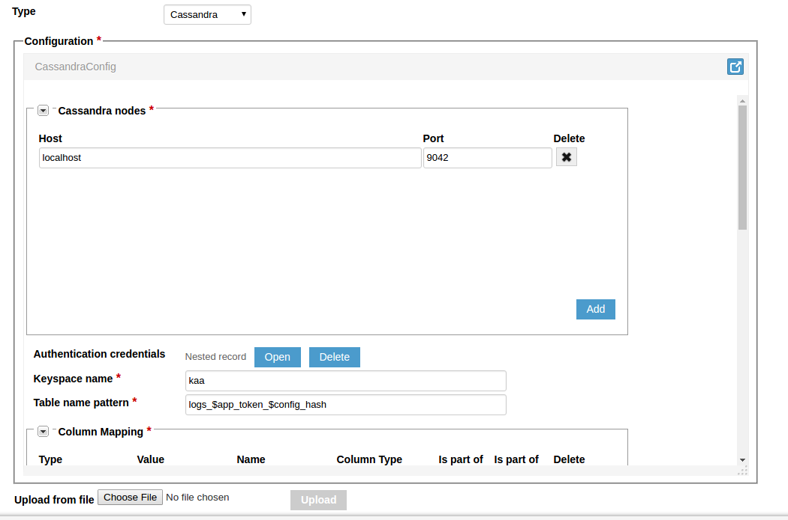



* TOC
{:toc}

The Cassandra log appender is used to transfer logs from the [Operations service]({{root_url}}Glossary/#operations-service) to the [Cassandra](http://cassandra.apache.org/) database.

## Create Cassandra log appender

To create a Cassandra log appender for your application using the [Administration UI]({{root_url}}Glossary/#administration-ui):

1. Log in to the **Administration UI** page as a [tenant developer]({{root_url}}Glossary/#tenant-developer).

2. Click **Applications** and open the **Log appenders** page of your application.
Click **Add log appender**.

3. On the **Log appender details** page, enter the necessary information and set the **Type** field to **Cassandra**.
	
	

4. Fill in the **Configuration** section for your log appender and click **Add**.
See [Configure log appender](#configure-log-appender).
	
	
	
	

Alternatively, you can use the [server REST API]({{root_url}}Programming-guide/Server-REST-APIs/#!/Logging/editLogAppender) to create or edit your Cassandra log appender.

The following example illustrates how to create an instance of Cassandra log appender using the server REST API.

```bash
curl -v -S -u devuser:devuser123 -X POST -H 'Content-Type: application/json' -d @cassandraLogAppender.json "http://localhost:8080/kaaAdmin/rest/api/logAppender" | python -mjson.tool
```

where file `cassandraLogAppender.json` contains the following data.

```json
{
    "pluginClassName":"org.kaaproject.kaa.server.appenders.cassandra.appender.CassandraLogAppender",
    "pluginTypeName":"Cassandra",
    "applicationId":"5",
    "applicationToken":"82635305199158071549",
    "name":"Cassandra log appender",
    "description":"Sample Cassandra log appender",
    "headerStructure":[
        "KEYHASH",
        "VERSION",
        "TIMESTAMP",
        "TOKEN",
        "LSVERSION"
    ],
    "maxLogSchemaVersion":2147483647,
    "minLogSchemaVersion":1,
    "tenantId":"1",
    "jsonConfiguration":"{\"cassandraServers\":[{\"host\":\"localhost\",\"port\":9042}],\"cassandraCredential\":{\"org.kaaproject.kaa.server.appenders.cassandra.config.gen.CassandraCredential\":{\"user\":\"user\",\"password\":\"password\"}},\"keySpace\":\"kaa\",\"tableNamePattern\":\"logs_$app_token_$config_hash\",\"columnMapping\":[{\"type\":\"HEADER_FIELD\",\"value\":{\"string\":\"applicationToken\"},\"columnName\":\"application_token\",\"columnType\":\"TEXT\",\"partitionKey\":false,\"clusteringKey\":false},{\"type\":\"EVENT_FIELD\",\"value\":{\"string\":\"message\"},\"columnName\":\"message\",\"columnType\":\"TEXT\",\"partitionKey\":false,\"clusteringKey\":false},{\"type\":\"UUID\",\"value\":{\"string\":\"id\"},\"columnName\":\"id\",\"columnType\":\"UUID\",\"partitionKey\":true,\"clusteringKey\":false}],\"clusteringMapping\":[],\"cassandraBatchType\":{\"org.kaaproject.kaa.server.appenders.cassandra.config.gen.CassandraBatchType\":\"UNLOGGED\"},\"cassandraSocketOption\":null,\"executorThreadPoolSize\":1,\"callbackThreadPoolSize\":2,\"dataTTL\":0,\"cassandraWriteConsistencyLevel\":{\"org.kaaproject.kaa.server.appenders.cassandra.config.gen.CassandraWriteConsistencyLevel\":\"ONE\"},\"cassandraCompression\":{\"org.kaaproject.kaa.server.appenders.cassandra.config.gen.CassandraCompression\":\"NONE\"},\"cassandraExecuteRequestType\":{\"org.kaaproject.kaa.server.appenders.cassandra.config.gen.CassandraExecuteRequestType\":\"SYNC\"}}"
}
```

Below is an example result.

```json
{
    "applicationId":"5",
    "applicationToken":"82635305199158071549",
    "confirmDelivery":true,
    "createdTime":1466055406507,
    "createdUsername":"devuser",
    "description":"Sample Cassandra log appender",
    "headerStructure":[
        "KEYHASH",
        "VERSION",
        "TIMESTAMP",
        "TOKEN",
        "LSVERSION"
    ],
    "id":"65548",
    "jsonConfiguration":"{\"cassandraServers\":[{\"host\":\"localhost\",\"port\":9042}],\"cassandraCredential\":{\"org.kaaproject.kaa.server.appenders.cassandra.config.gen.CassandraCredential\":{\"user\":\"user\",\"password\":\"password\"}},\"keySpace\":\"kaa\",\"tableNamePattern\":\"logs_$app_token_$config_hash\",\"columnMapping\":[{\"type\":\"HEADER_FIELD\",\"value\":{\"string\":\"applicationToken\"},\"columnName\":\"application_token\",\"columnType\":\"TEXT\",\"partitionKey\":false,\"clusteringKey\":false},{\"type\":\"EVENT_FIELD\",\"value\":{\"string\":\"message\"},\"columnName\":\"message\",\"columnType\":\"TEXT\",\"partitionKey\":false,\"clusteringKey\":false},{\"type\":\"UUID\",\"value\":{\"string\":\"id\"},\"columnName\":\"id\",\"columnType\":\"UUID\",\"partitionKey\":true,\"clusteringKey\":false}],\"clusteringMapping\":[],\"cassandraBatchType\":{\"org.kaaproject.kaa.server.appenders.cassandra.config.gen.CassandraBatchType\":\"UNLOGGED\"},\"cassandraSocketOption\":null,\"executorThreadPoolSize\":1,\"callbackThreadPoolSize\":2,\"dataTTL\":0,\"cassandraWriteConsistencyLevel\":{\"org.kaaproject.kaa.server.appenders.cassandra.config.gen.CassandraWriteConsistencyLevel\":\"ONE\"},\"cassandraCompression\":{\"org.kaaproject.kaa.server.appenders.cassandra.config.gen.CassandraCompression\":\"NONE\"},\"cassandraExecuteRequestType\":{\"org.kaaproject.kaa.server.appenders.cassandra.config.gen.CassandraExecuteRequestType\":\"SYNC\"}}",
    "maxLogSchemaVersion":2147483647,
    "minLogSchemaVersion":1,
    "name":"Cassandra log appender",
    "pluginClassName":"org.kaaproject.kaa.server.appenders.cassandra.appender.CassandraLogAppender",
    "pluginTypeName":"Cassandra",
    "tenantId":"1"
}
```

## Configure log appender

The Cassandra log appender configuration must match [this Avro schema]({{github_url}}server/appenders/cassandra-appender/src/main/avro/cassandra-appender-config.avsc).

You can configure the following log appender settings:

* **Cassandra nodes** -- list of Cassandra hosts.
* **Authentication credentials** -- credentials used to authenticate on Cassandra cluster.
* **Keyspace name** -- Cassandra keyspace used to prefix the data table.
* **Table name pattern** -- pattern used to create table name (e.g. `logs_$app_token` adds the application token at the end of the table name).
* **Column mapping** -- mapping of specific log data to appropriate columns.
* **Clustering** -- clustering key configuration.

|Type           |Example value                                                                  |Example column type|Description                                                         |
|---------------|-------------------------------------------------------------------------------|-------------------|--------------------------------------------------------------------|
|`HEADER_FIELD`   |`endpointKeyHash`, `applicationToken`, `headerVersion`, `timestamp`, `logSchemaVersion`   |TEXT               |Maps a header variable to the specified column.                   |
|`EVENT_FIELD`    |`telemetry`                                                                      |DOUBLE             |Maps a log schema field to the specified column.                  |
|`CLIENT_FIELD`   |`clientField`                                                                    |TEXT               |Maps a client-side endpoint profile field to the specified column.|
|`SERVER_FIELD`   |`serverField`                                                                    |TEXT               |Maps a server-side endpoint profile field to the specified column.|
|`${TYPE}_JSON`   |                                                                               |TEXT               |Maps one of the fields listed above as a corresponding JSON.      |
|`${TYPE}_BINARY` |                                                                               |BLOB               |Maps one of the fields listed above in binary format.             |
|`UUID`           |                                                                               |UUID               |Maps a UUID generated by Kaa to the specified field.              |
|`TS`             |yyyy-MM-dd-'Time:'HH:mm:ss.SS                                                  |TEXT               |Maps a timestamp generated by Kaa to the specified field. Timestamp pattern is handled by `java.text.SimpleDateFormat` |

Use the checkboxes to make any field a partition and/or clustering key.

Configure the key clustering in the **Clustering** section by adding column names and setting their order (**DESC** or **ASC**).

>**NOTE:** You can specify Cassandra driver settings in the log appender configuration.
>See [official documentation](http://docs.datastax.com/en/landing_page/doc/landing_page/current.html).
{:.note}

Below is an example configuration that matches the mentioned Avro schema.

```json
{
    "cassandraServers":[
        {
            "host":"localhost",
            "port":9042
        }
    ],
    "cassandraCredential":{
        "org.kaaproject.kaa.server.appenders.cassandra.config.gen.CassandraCredential":{
            "user":"user",
            "password":"password"
        }
    },
    "keySpace":"kaa",
    "tableNamePattern":"logs_$app_token_$config_hash",
    "columnMapping":[
        {
            "type":"HEADER_FIELD",
            "value":{
                "string":"applicationToken"
            },
            "columnName":"application_token",
            "columnType":"TEXT",
            "partitionKey":false,
            "clusteringKey":false
        },
        {
            "type":"EVENT_FIELD",
            "value":{
                "string":"message"
            },
            "columnName":"message",
            "columnType":"TEXT",
            "partitionKey":false,
            "clusteringKey":false
        },
        {
            "type":"UUID",
            "value":{
                "string":"id "
            },
            "columnName":"id",
            "columnType":"UUID",
            "partitionKey":true,
            "clusteringKey":false
        }
    ],
    "clusteringMapping":[

    ],
    "cassandraBatchType":{
        "org.kaaproject.kaa.server.appenders.cassandra.config.gen.CassandraBatchType":"UNLOGGED"
    },
    "cassandraSocketOption":null,
    "executorThreadPoolSize":1,
    "callbackThreadPoolSize":2,
    "dataTTL":0,
    "cassandraWriteConsistencyLevel":{
        "org.kaaproject.kaa.server.appenders.cassandra.config.gen.CassandraWriteConsistencyLevel":"ONE"
    },
    "cassandraCompression":{
        "org.kaaproject.kaa.server.appenders.cassandra.config.gen.CassandraCompression":"NONE"
    },
    "cassandraExecuteRequestType":{
        "org.kaaproject.kaa.server.appenders.cassandra.config.gen.CassandraExecuteRequestType":"SYNC"
    }
}
```

## Playing with Cassandra log appender

The example below uses the **Data collection demo** from [Kaa Sandbox]({{root_url}}Glossary/#kaa-sandbox).
The log appender will send data to Kaa and then persist it to Cassandra.
Some selection queries will be demonstrated using the persisted data.

Below is the log schema for the application.

```json
{
    "type":"record",
    "name":"Data",
    "namespace":"org.kaaproject.kaa.scheme.sample",
    "fields":[
        {
            "name":"temperature",
            "type":"int"
        },
        {
            "name":"timeStamp",
            "type":"long"
        }
    ],
    "displayName":"Logging scheme"
}
```

The following JSON example matches the above schema.

```json
{
    "temperature":"28",
    "timeStamp":"1474366798"
}
```

To play around with the the Cassandra log appender:

1. Open the Data collection demo from Kaa Sandbox and follow the application installation instructions.

2. Log in to the **Administration UI** as a tenant developer, open the **Log appenders** page of the **Data collection** application and click **Add log appender**.

3. Enter the log appender name.
Add **Application token** and **Timestamp** in the **Log metadata** field.
Set the **Type** field to **Cassandra**.
	

4. In the **Configuration** section, add a new node.
Set **Host** to **localhost** and **Port** to **9042**.
	
	
5. Add authentication credentials if needed.
In this example, **kaa** is used as the **Keyspace name** because it's already created on the Sandbox machine.
	
	
6. Set up the column mapping.
	
	
7. Configure other settings as necessary and click the **Add** button.
	
	
8. Run the Data collection demo application from Kaa Sandbox.

9. The console will display the following messages.

		Data collection demo started
		Received new sample period: 1
		Sampled temperature 28 1474366979
		Sampled temperature 31 1474366980
		Sampled temperature 32 1474366981
		Sampled temperature 30 1474366982
		Sampled temperature 28 1474366983
		...
		
10. To verify that your logs have been persisted to Cassandra, open the Sandbox VM and run the following command.

    ```bash
    cqlsh
    ```

    Then run

    ```bash
    SELECT * FROM kaa.logs_example;
    ```

11. The following output will be displayed.

    ```bash
     date                         | timestamp_field | id                                   | application_token    | temperature_field
    ------------------------------+-----------------+--------------------------------------+----------------------+-------------------
     2016-09-20-Time:03:21:54.532 |      1474366979 | 8206acb5-e8b8-447f-bb61-757f25c154e9 | 65691512829156876532 |                28
     2016-09-20-Time:03:21:54.532 |      1474366980 | 193df613-3b0a-4498-b0fe-71ac8f8f964d | 65691512829156876532 |                31
     2016-09-20-Time:03:21:54.532 |      1474366981 | 26af685a-962a-4c6d-910d-3a08e66819cd | 65691512829156876532 |                32
     2016-09-20-Time:03:21:54.532 |      1474366982 | 6a276954-4adc-41c2-b3cb-bb09bf683b4b | 65691512829156876532 |                30
     2016-09-20-Time:03:21:54.532 |      1474366983 | 01e8408a-c2cd-451a-a402-ceafdd7c9df6 | 65691512829156876532 |                28
     ...
(5 rows)
    ```

If you don't get the desired output or experience other problems, see [Troubleshooting]({{root_url}}Administration-guide/Troubleshooting).
